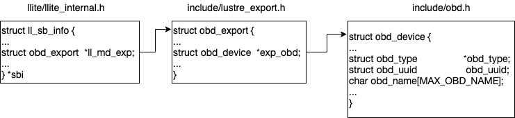
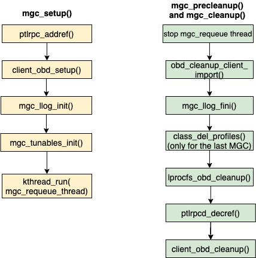

# Lustre Architecture

## What is Lustre?

Lustre is a GNU General Public licensed, open-source distributed parallel file system developed and maintained by DataDirect Networks (DDN). Due to the extremely scalable architecture of the Lustre file system, Lustre deployments are popular in scientific supercomputing, as well as in the oil and gas, manufacturing, rich media, and finance sectors. Lustre presents a POSIX interface to its clients with parallel access capabilities to the shared file objects. As of this writing, Lustre is the most widely used file system on the top 500 fastest computers in the world. Lustre is the file system of choice on 7 out of the top 10 fastest computers in the world today, over 70% of the top 100, and also for over 60% of the top 500。

> Lustre 是一个由 DDN 开发和维护的、开源的、GPL协议下的分布式并行文件系统。Lustre 架构具有极强的扩展性，在超算，石油，天然气，制造业，富媒体，金融行业等领域大量部署。Lustre 向其客户端提供具有并行访问共享文件对象的 POSIX 接口。截至目前，Lustre 是全球最快计算机 TOP 500榜单中使用最多的文件系统。在前十名中，有7台选择 Lustre 作为文件系统，并且在前100名中，超过70%的使用率；在前500名中，也超过60%的使用率。

## Lustre Features

Lustre is designed for scalability and performance. The aggregate storage capacity and file system bandwidth can be scaled up by adding more servers to the file system, and performance for parallel applications can often be increased by utilizing more Lustre clients. Some practical limits are shown in Table 1 along with values from known production file systems.

> Lustre 为了扩展性和性能的目录而设计。它的存储容量和聚合性能随着服务器增加不断扩展，并且提供给并行应用的性能可以随着客户端的增加而增长。下表展示一些当前的理论限制范围和在已知生产系统中的实践值。

特性 | 理论限制范围 | 已知生产系统的实践值
:- | :- | :-
客户端扩展性 | 100 - 100,000个 | 50,000+ 客户端, 大多数在10,000到20,000之间
客户端性能 | 单客户端：90%的网络带宽 <br> 聚合：10TB/s | 单客户端带宽：4.5GB/s(FDR IB, OPA1), 元数据性能：1000 ops/s <br> 聚合：2.5TB/s
OSS 扩展性 | OSS：每个OSS可拥有1-32个 OST <br> OST（ldiskfs）：300M 个对象，每个 OST 可达256TiB  <br> OST（ZFS）：500M个对象，每个 OST 可达256TiB <br> OSS 数量：最多1000个 OSS，每个 OSS最多拥有4000个 OST | OSS（ldiskfs）：每个 OSS 可拥有32个8TiB OST，或者每个OSS可拥有8个32TiB OST <br> OSS（ZFS）：每个OSS可拥有1个72TiB OST <br> OSS数量：有450个 OSS，每个OSS有1000个4TiB OST；或者有192个 OSS，每个 OSS 有1344个8TiB OST；或者有768个OSS，每个OSS有768个72TiB OST
OSS 性能 | 单个OSS：15GB/s <br> 聚合：10TB/s | 单个 OSS: 10 GB/s <br> 聚合: 2.5 TB/s
MDS 扩展性 | MDS：每个 MDS 可拥有 1-4个 MDT <br> MDT（ldiskfs）：每个MDT可拥有40亿个文件，8 TiB容量 <br> MDT（ZFS）：每个 MDT 可拥有640亿个文件，64 TiB容量 <br> MDS数量：有256个 MDS，每个 MDS 最多拥有265个 MDT | MDS：每个 MDS 可拥有30亿个文件 <br> MDS数量：在生产环境中有7个 MDS，每个 MDS 拥有7个2 TiB的 MDT（在测试环境中有256个 MDS，每个 MDS 拥有256个64 GiB 的 MDT）
MDS 性能 | create： 50,000 ops/s <br> stats：200,000 ops/s | create： 15,000 ops/s <br> stats：50,000 ops/s
文件系统扩展性 | 单个文件（最大大小）：32 PiB（ldiskfs）或 $$ 2^{63} $$ bytes（ZFS） <br> 总体：512 PiB 的总容量，1万亿个文件 | 单个文件（最大大小）：TiB 级 <br> 总体：55 PiB 的总容量，80亿个文件

Lustre has several features that enhance performance, usability, and stability. Some of these features include:

Lustre 具有多种特性，以用于性能提升、可用性和稳定性的需求。一些特性总结如下：

- POSIX Compliance: With few exceptions, Lustre passes the full POSIX test suite. Most operations are atomic to ensure that clients do not see stale data or metadata. Lustre also supports mmap() file IO.

> POSIX 兼容性：Lustre 几乎通过了 POSIX 的兼容性测试。其大部分操作是原子性，以确保对客户端的透明性。另外 Lustre 支持 mmap 文件 IO。

- Online file system checking: Lustre provides a file system checker (LFSCK) to detect and correct file system inconsistencies. LFSCK can be run while the file system in online and in production, minimizing potential downtime.

> 数据在线校验：Lustre 使用 LFSCK 工具检查文件系统的数据一致性。LFSCK 可以在生产环境中在线运行，减少潜在的存储服务下线时间。

- Controlled file layouts: The file layouts that determine how data is placed across the Lustre servers can be customized on a per-file basis. This allows users to optimize the layout to best fit their specific use case.

> 可控的文件布局：文件布局决定数据的存放位置。Lustre 布局方式可以基于文件的粒度。用户可根据其使用场景优化文件布局方式。

- Support for multiple backend file systems: When formatting a Lustre file system, the underlying storage can be formatted as either ldiskfs (a performance-enhanced version of ext4) or ZFS.

> 后端文件系统：Lustre 现支持两种后端文件系统：ldiskfs 和 zfs。

- Support for high-performance and heterogeneous networks: Lustre can utilize RDMA over low latency networks such as Infiniband or Intel OmniPath in addition to supporting TCP over commodity networks. The Lustre networking layer provides the ability to route traffic between multiple networks making it feasible to run a single site-wide Lustre file system.

> 异构网络和高性能网络：Lustre 不仅支持在低延时的 IB 和 OmniPath 网络使用 RDMA，也支持普通的 TCP 网络。Lustre 的网络层适配不同网络，所以在不同网络环境中可以部署一套 Lustre 系统。

- High-availability: Lustre supports active/active failover of storage resources and multiple mount protection (MMP) to guard against errors that may results from mounting the storage simultaneously on multiple servers. High availability software such as Pacemaker/Corosync can be used to provide automatic failover capabilities.

> 高可用性：提供 active/active 存储资源的 failover 机制和 MMP 机制，防止不同服务器同时挂载同一个存储介质的问题。Pcs 等高可用软件提供自动挂载的故障恢复功能。

- Security features: Lustre follows the normal UNIX file system security model enhanced with POSIX ACLs. The root squash feature limits the ability of Lustre clients to perform privileged operations. Lustre also supports the configuration of Shared-Secret Key (SSK) security.

- 数据安全：Lustre 遵循 UNIX 文件安全标准：ACLs。root squash 特性限制客户端执行特权操作。Lustre 也支持 SSK。

- Capacity growth: File system capacity can be increased by adding additional storage for data and metadata while the file system in online.

- 容量扩容：在线扩容。通过增加存储的方式增加数据或元数据的容量。

## Lustre Components

Lustre is an object-based file system that consists of several components:

> Lustre 是一个基于对象的存储，包含以下几个组件：

- Management Server (MGS) - Provides configuration information for the file system. When mounting the file system, the Lustre clients will contact the MGS to retrieve details on how the file system is configured (what servers are part of the file system, failover information, etc.). The MGS can also proactively notify clients about changes in the file system configuration and plays a role in the Lustre recovery process.

> 管理服务器（MGS）：提供文件系统的配置信息。Lustre 客户端挂载时，会和 MGS 请求检索详细的配置信息，如文件系统中服务器部分，故障对信息等等。当配置更改时，MGS 主动通知客户端。另外担任恢复处理的角色。

- Management Target (MGT) - Block device used by the MGS to persistently store Lustre file system configuration information. It typically only requires a relatively small amount of space (on the order to 100 MB).

> 管理器目标（MGT）：MGS 存储 Lustre 文件系统配置信息的块设备。容量需求不大，一般为100MB。

- Metadata Server (MDS) - Manages the file system namespace and provides metadata services to clients such as filename lookup, directory information, file layouts, and access permissions. The file system will contain at least one MDS but may contain more.

> 元数据服务器（MDS）：管理文件系统命名空间和提供元数据服务，例如查找文件名，目录信息，文件布局和访问权限。Lustre 至少包含一个 MDS。

- Metadata Target (MDT) - Block device used by an MDS to store metadata information. A Lustre file system will contain at least one MDT which holds the root of the file system, but it may contain multiple MDTs. Common configurations will use one MDT per MDS server, but it is possible for an MDS to host multiple MDTs. MDTs can be shared among multiple MDSs to support failover, but each MDT can only be mounted by one MDS at any given time.

> 元数据目标（MDT）：MDS 存储元数据的块设备。Lustre 至少包含一个 MDT 提供文件系统的根。一般情况下，每个 MDS 上配置一个 MDT，但也有可能一个 MDS 包含多个 MDT。故障对可以通过多个 MDS 共享同一个 MDT的方式实现，但在同一个时刻，一个 MDT 只能被一个 MDS 挂载。

- Object Storage Server (OSS) - Stores file data objects and makes the file contents available to Lustre clients. A file system will typically have many OSS nodes to provide a higher aggregate capacity and network bandwidth.

> 对象存储服务器：存储文件数据对象，提供文件数据的访问给客户端。通常 Lustre 会配置多个 OSS 来增加容量和提高网络带宽。

- Object Storage Target (OST) - Block device used by an OSS node to store the contents of user files. An OSS node will often host several OSTs. These OSTs may be shared among multiple hosts, but just like MDTs, each OST can only be mounted on a single OSS at any given time. The total capacity of the file system is the sum of all the individual OST capacities.

> 对象存储目录：OSS 存储用户文件数据的块设备。OSS 节点挂载多个 OST，另外，每一个 OST 也被多个 OSS 共享。和 MDT 相同，同一时刻，每个 OST 只能被一个 OSS 挂载。Lustre 系统的总容量为所有 OST 容量之和。

- Lustre Client - Mounts the Lustre file system and makes the contents of the namespace visible to the users. There may be hundreds or even thousands of clients accessing a single Lustre file system. Each client can also mount more than one Lustre file system at a time.

> Lustre 客户端：挂载 Lustre 文件系统，提供给用户统一文件系统命名空间。Lustre 文件系统可以同时存在成百上千的客户端。另外，客户端也可以同时挂载不同的 Lustre 系统。

- Lustre Networking (LNet) - Network protocol used for communication between Lustre clients and servers. Supports RDMA on low-latency networks and routing between heterogeneous networks.

> Lustre 网络（LNet）：LNet 用于客户端和服务端之间的通信，支持在异构的低延时网络和路由上使用 RDMA。

The collection of MGS, MDS, and OSS nodes are sometimes referred to as the “frontend”. The individual OSTs and MDTs must be formatted with a local file system in order for Lustre to store data and metadata on those block devices. Currently, only ldiskfs (a modified version of ext4) and ZFS are supported for this purpose. The choice of ldiskfs or ZFS if often referred to as the “backend file system”. Lustre provides an abstraction layer for these backend file systems to allow for the possibility of including other types of backend file systems in the future.

> MGS、MDS 和 OSS 节点被称为“前端”，ldiskfs 或 ZFS 称为“后端文件系统”。在 Lustre 中，OST 和 MDT 对应的块设备必须格式化为本地文件系统：ldiskfs（ext4 的修改版） 或 ZFS，以用于存放数据。Lustre 为不同的后端文件系统提供一个抽象层。未来也支持其他的类型的后端文件系统（基本没动力的）。

Figure 1 shows a simplified version of the Lustre file system components in a basic cluster. In this figure, the MGS server is distinct from the MDS servers, but for small file systems, the MGS and MDS may be combined into a single server and the MGT may coexist on the same block device as the primary MDT.

> 图1展示一个简化的 Lustre 组件图。在这张图中，MGS 和 MDS 在不同的服务器上。不过在小型的 Lustre集群上，MGS 和 MDS 使用同一个块设备作为 MGT 和 MDT。

<div align=center style="margin-bottom:12px;margin-top:12px">
    
    <figcaption style="font-size:12px">Figure 1. Lustre file system components in a basic cluster.</figcaption>
</div>

## Lustre File Layouts

Lustre stores file data by splitting the file contents into chunks and then storing those chunks across the storage targets. By spreading the file across multiple targets, the file size can exceed the capacity of any one storage target. It also allows clients to access parts of the file from multiple Lustre servers simultaneously, effectively scaling up the bandwidth of the file system. Users have the ability to control many aspects of the file’s layout by means of the lfs setstripe command, and they can query the layout for an existing file using the lfs getstripe command.

File layouts fall into one of two categories:

1. Normal / RAID0 - File data is striped across multiple OSTs in a round-robin manner.

1. Composite - Complex layouts that involve several components with potentially different striping patterns.

### Normal (RAID0) Layouts

A normal layout is characterized by a stripe count and a stripe size. The stripe count determines how many OSTs will be used to store the file data, while the stripe size determines how much data will be written to an OST before moving to the next OST in the layout. As an example, consider the file layouts shown in Figure 2 for a simple file system with 3 OSTs residing on 3 different OSS nodes. Note that Lustre indexes the OSTs starting at zero.

<div align=center style="margin-bottom:12px;margin-top:12px">
    
    <figcaption style="font-size:12px">Figure 2. Normal RAID0 file striping in Lustre.</figcaption>
</div>

File A has a stripe count of three, so it will utilize all OSTs in the file system. We will assume that it uses the default Lustre stripe size of 1MB. When File A is written, the first 1MB chunk gets written to OST0. Lustre then writes the second 1MB chunk of the file to OST1 and the third chunk to OST2. When the file exceeds 3 MB in size, Lustre will round-robin back to the first allocated OST and write the fourth 1MB chunk to OST0, followed by OST1, etc. This illustrates how Lustre writes data in a RAID0 manner for a file. It should be noted that although File A has three chunks of data on OST0 (chunks #1, #4, and #7), all these chunks reside in a single object on the backend file system. From Lustre’s point of view, File A consists of three objects, one per OST. Files B and C show layouts with the default Lustre stripe count of one, but only File B uses the default stripe size of 1MB. The layout for File C has been modified to use a larger stripe size of 2MB. If both File B and File C are 2MB in size, File B will be treated as two consecutive chunks written to the same OST whereas File C will be treated as a single chunk. However, this difference is mostly irrelevant since both files will still consist of a single 2MB object on their respective OSTs.

# TEST

略

# UTILS

略

# MGC

<h2 id="mgc-introduction">Introduction</h2>

The Lustre client software involves primarily three components, management client (MGC), a metadata client (MDC), and multiple object storage clients (OSCs), one corresponding to each OST in the file system. Among this, the management client acts as an interface between Lustre virtual file system layer and Lustre management server (MGS). MGS stores and provides information about all Lustre file systems in a cluster. Lustre targets register with MGS to provide information to MGS while Lustre clients contact MGS to retrieve information from it.

> Lustre 客户端软件主要涉及三个组件，管理客户端（MGC）、元数据客户端（MDC）和多个对象存储客户端（OSC）[^1]，每个 OSC 对应一个 OST。 MGC 连接了 Lustre 虚拟文件系统层与 Lustre 管理服务器（MGS）。MGS 存储并提供有关集群中所有 Lustre 文件系统的配置信息。Lustre 目标通过向 MGS 注册的方式向 MGS 提供信息，而 Lustre 客户端向 MGS 获取配置信息。

The major functionalities of MGC are Lustre log handling, Lustre distributed lock management and file system setup. MGC is the first obd device created in Lustre obd device life cycle. An obd device in Lustre provides a level of abstraction on Lustre components such that generic operations can be applied without knowing the specific devices you are dealing with. The remaining Sections describe MGC module initialization, various MGC obd operations and log handling in detail. In the following Sections we will be using the terms clients and servers to represent service clients and servers created to communicate between various components in Lustre. Whereas the physical nodes representing Lustre’s clients and servers will be explicitly mentioned as ‘Lustre clients’ and ‘Lustre servers’.

> MGC 的主要功能包括 Lustre 日志处理、Lustre 分布式锁管理和文件系统的初始化。MGC 是在 Lustre obd 设备生命周期中第一个被创建的 obd 设备[^2]。Lustre 中的 obd 设备为 Lustre 组件提供了一层抽象，使得组件可以使用通用操作，而无需了解正在处理的具体设备。其余部分详细描述了 MGC 模块的初始化、各种 MGC obd 操作以及日志处理。在接下来的部分中，我们将使用"clients"和"servers"这些术语来代表为了在 Lustre 的各个组件之间进行通信而被创建的客户端和服务端的服务。而表示Lustre的客户端和服务端的物理节点将明确标注为"Lustre clients"和"Lustre servers"。

## MGC Module Initialization

When the MGC module initializes, it registers MGC as an obd device type with Lustre using class_register_type() as shown in Source Code 1. Obd device data and metadata operations are defined using the obd_ops and md_ops structures respectively. Since MGC deals with metadata in Lustre, it has only obd_ops operations defined. However the metadata client (MDC) has both metadata and data operations defined since the data operations are used to implement Data on Metadata (DoM) functionality in Lustre. The class_register_type() function passes &mgc_obd_ops, NULL, false, LUSTRE_MGC _NAME, and NULL as its arguments. LUSTRE_MGC_NAME is defined as “mgc” in include/obd.h.

> 当 MGC 模块初始化时，它使用 class_register_type() 将 MGC 注册为一种 obd 设备类型，如源代码1所示。obd_ops 和 md_ops 结构分别定义了 obd 设备的数据和元数据操作。由于 MGC 只处理Lustre中的元数据，只定义了obd_ops操作。然而，元数据客户端（MDC）既有元数据操作，又有数据操作，因为数据操作用于实现 Lustre 中DoM 功能。class_register_type() 的参数为 &mgc_obd_ops、NULL、false、LUSTRE_MGC_NAME 和 NULL。在 include/obd.h 中，LUSTRE_MGC_NAME 被定义为"mgc"。

## MGC obd Operations

MGC obd operations are defined by mgc_obd_ops structure as shown in Source Code 2. Note that all MGC obd operations are defined as function pointers. This type of programming style avoids complex switch cases and provides a level of abstraction on Lustre components such that the generic operations can be applied without knowing the details of specific obd devices.

> MGC obd 操作由 mgc_obd_ops 结构定义，如源代码2所示。请注意，所有 MGC obd 操作都被定义为函数指针。这种编程风格避免了复杂的 switch 语句，并为 Lustre 组件提供了一层抽象，使得可以进行通用操作，而无需了解特定 obd 设备的详细信息。

Source Code 2: mgc_obd_ops structure defined in mgc/mgc_request.c

```c
static const struct obd_ops mgc_obd_ops = {
        .o_owner        = THIS_MODULE,
        .o_setup        = mgc_setup,
        .o_precleanup   = mgc_precleanup,
        .o_cleanup      = mgc_cleanup,
        .o_add_conn     = client_import_add_conn,
        .o_del_conn     = client_import_del_conn,
        .o_connect      = client_connect_import,
        .o_disconnect   = client_disconnect_export,
        .o_set_info_async = mgc_set_info_async,
        .o_get_info       = mgc_get_info,
        .o_import_event = mgc_import_event,
        .o_process_config = mgc_process_config,
};
```

In Lustre one of the ways two subsystems share data is with the help of obd_ops structure. To understand how the communication between two subsystems work let us take an example of mgc_get_info() from the mgc_obd_ops structure. The subsystem llite makes a call to mgc_get_info() (in llite/llite_lib.c) by passing a key (KEY_CONN_DATA) as an argument. But notice that llite invokes obd_get_info() instead of mgc_get_info(). obd_get_info() is defined in include/obd_class.h as shown in Figure 6. We can see that this function invokes an OBP macro by passing an obd_export device structure and a get_info operation. The definition of this macro concatenates o with op (operation) so that the resulting function call becomes o_get_info().

> 在 Lustre 中，两个子系统之间共享数据的一种方式是通过 obd_ops 结构。为了理解两个子系统之间的通信是如何工作的，让我们以 mgc_obd_ops 结构中的 mgc_get_info() 为例。子系统 llite 通过将一个宏（KEY_CONN_DATA）作为参数调用 mgc_get_info()（llite/llite_lib.c）。注意，llite 调用的是 obd_get_info() 而不是直接调用 mgc_get_info()。obd_get_info()（include/obd_class.h），如图6所示。我们可以看到，函数调用一个 OBP 宏，它的参数是 obd_export 和 get_info。OBP 宏将 o（obd_export 设备结构）和 op（操作）连接在一起，宏替换为函数调用 o_get_info()。

<div align=center style="margin-bottom:12px;margin-top:12px">
    
    <figcaption style="font-size:12px">Figure 6. Communication between llite and mgc through obdclass.</figcaption>
</div>

So how does llite make sure that this operation is directed specifically towards MGC obd device? obd_get_info() from llite/llite_lib.c has an argument called sbi-\>ll_md_exp. The sbi structure is a type of ll_sb_info defined in llite/llite_internal.h (refer Figure 7). And the ll_md_exp field from ll_sb_info is a type of obd_export structure defined in include/lustre_export.h. obd_export structure has a field \*exp_obd which is an obd_device structure (defined in include/obd.h). Another MGC obd operation obd_connect() retrieves export using the obd_device structure. Two functions involved in this process are class_name2obd() and class_num2obd() defined in obdclass/genops.c.

> 那么，llite 如何确保以上的操作是针对 MGC obd 设备的？llite/llite_lib.c 中的 obd_get_info() 有一个名为 sbi->ll_md_exp 的参数。sbi 的类型是 ll_sb_info，它在 llite/llite_internal.h 中定义（图7）。而 ll_sb_info 中的 ll_md_exp 字段在 include/lustre_export.h 中定义，类型为 obd_export。obd_export 中的 \*exp_obd 成员，它是一个 obd_device 结构（在include/obd.h中定义）。另一个 MGC obd 操作 obd_connect() 使用obd_device 检查获取导出项。参与此流程的两个函数分别为 class_name2obd() 和 class_num2obd()，它们都在 obdclass/genops.c 中定义。

<div align=center style="margin-bottom:12px;margin-top:12px">
    
    <figcaption style="font-size:12px">Figure 7. Data structures involved in the communication between mgc and llite subsystems.</figcaption>
</div>

In the following Sections we describe some of the important MGC obd operations in detail.

> 在接下来的部分中，我们将详细描述一些重要的 MGC obd 操作。

## mgc_setup()

mgc_setup() is the initial routine that gets executed to start and setup the MGC obd device. In Lustre MGC is the first obd device that is being setup as part of the obd device life cycle process. To understand when mgc_setup() gets invoked in the obd device life cycle, let us explore the workflow from the Lustre module initialization.

> mgc_setup() 是启动和配置 MGC obd 设备的初始化函数。在 Lustre 中，作为 obd 设备生命周期过程的一部分，MGC 是第一个进行配置的 obd 设备。为了理解 mgc_setup() 在 obd 设备生命周期中何时被调用，让我们从 Lustre 模块初始化的工作流程入手。

The Lustre module initialization begins from the lustre_init() routine defined in llite/super25.c (shown in Figure 8). This routine is invoked when the ‘lustre’ module gets loaded. lustre_init() invokes register_filesystem(\&lustre_fs_type) which registers ‘lustre’ as the file system and adds it to the list of file systems the kernel is aware of for mount and other syscalls. lustre_fs_type structure is defined in the same file as shown in Source Code 3.

> Lustre 模块初始化从 llite/super25.c中的 lustre_init() 开始。当 ‘lustre’ 内核模块被加载时，这个函数就被调用。lustre_init 调用 register_filesystem(\&lustre_fs_type)，注册‘lustre’到文件系统中，并把它加入内核文件系统的链表中，这个链表被用于挂载等系统调用。lustre_fs_type 也在同个文件进行定义（源码3）。

<div align=center style="margin-bottom:12px;margin-top:12px">
    
    <figcaption style="font-size:12px">Figure 8. mgc_setup() call graph starting from Lustre file system mounting.</figcaption>
</div>

Source code 3: lustre_fs_type structure defined in llite/super25.c

```c
static struct file_system_type lustre_fs_type = {
        .owner          = THIS_MODULE,
        .name           = "lustre",
        .mount          = lustre_mount,
        .kill_sb        = lustre_kill_super,
        .fs_flags       = FS_RENAME_DOES_D_MOVE,
};
```

When a user mounts Lustre, the lustre_mount() gets invoked as evident from this structure. lustre_mount() is defined in the same file and which in turn calls mount_nodev() routine. The mount_nodev() invokes its call back function lustre_fill_super() which is also defined in llite/super25.c. lustre_fill_super() is the entry point for the mount call from the Lustre client into Lustre.

> 当用户挂载 Lustre 时，lustre_mount() 就被调用（llite/super25.c），之后调用 mount_nodev()。mount_nodev() 调用其回调函数 lustre_fill_super()（llite/super25.c 中定义），lustre_fill_super() 挂载调用是 Lustre 客户端进入 Lustre 的入口点。

lustre_fill_super() invokes lustre_start_mgc() defined in obdclass/obd_mount.c. This sets up the MGC obd device to start processing startup logs. The lustre_start_simple() routine called here starts the MGC obd device (defined in obdclass/obd_mount.c). lustre_start_simple() eventually leads to the invocation of obdclass specific routines class_attach() and class_setup() (described in detail in the Section 5) with the help of a do_lcfg() routine that takes obd device name and a lustre configuration command (lcfg_command) as arguments. Various lustre configuration commands are LCFG_ATTACH, LCFG_DETACH, LCFG_SETUP, LCFG_CLEANUP and so on. These are defined in include/uapi/linux/lustre/lustre_cfg.h as shown in Source Code 4.

> lustre_fill_super() 调用在 obdclass/obd_mount.c 中定义的 lustre_start_mgc()。这将设置 MGC obd 设备和开始处理启动日志。在这里调用的 lustre_start_simple() 启动 MGC obd设备（在obdclass/obd_mount.c中定义）。lustre_start_simple() 最终会通过 do_lcfg() 调用 obdclass 特定的 class_attach() 和 class_setup()（在第5节中详细描述），do_lcfg() 以 obd 设备名称和 Lustre 配置命令（lcfg_command）作为参数。Lustre 配置命令如 LCFG_ATTACH、LCFG_DETACH、LCFG_SETUP、LCFG_CLEANUP 等在 include/uapi/linux/lustre/lustre_cfg.h 中定义，如源代码4所示。

Source code 4: Lustre configuration commands defined in include/uapi/linux/lustre/lustre_cfg.h

```c
enum lcfg_command_type {
        LCFG_ATTACH               = 0x00cf001, /**< create a new obd instance */
        LCFG_DETACH               = 0x00cf002, /**< destroy obd instance */
        LCFG_SETUP                = 0x00cf003, /**< call type-specific setup */
        LCFG_CLEANUP              = 0x00cf004, /**< call type-specific cleanup
                                                    */
        LCFG_ADD_UUID             = 0x00cf005, /**< add a nid to a niduuid */
        . . . . .
};
```

The first lcfg_command that is being passed to do_lcfg() routine is LCFG_ATTACH which will result in the invocation of obdclass function class_attach(). We will describe class_attach() in detail in Section 5. The second lcfg_command passed to do_lcfg() function is LCFG_SETUP which will result in the invocation of mgc_setup() eventually. do_lcfg() calls class_process_config() (defined in obdclass/obd_config.c) and passes the lcfg_command that it received. In case of LCFG_SETUP command the class_setup() routine gets invoked. This is defined in the same file and its primary duty is to create hashes and self export and call obd device specific setup. The device specific setup call is in turn invoked through another routine called obd_setup(). obd_setup() is defined in include/obd_class.h as an inline function in the same way obd_get_info() is defined. obd_setup() calls the device specific setup routine with the help of the OBP macro (refer Section 4.3 and Figure 6). Here, in case of MGC obd device mgc_setup() defined as part of the mgc_obd_ops structure (shown in Source Code 2) gets invoked by the obd_setup() routine. Note that the yellow colored blocks in Figure 8 will be referenced again in Section 5 to illustrate the lifecycle of the MGC obd device.

> 第一个被作为 do_lcfg() 参数的 lcfg_command 是 LCFG_ATTACH，并最终调用 obdclass 的函数 class_attach()。我们将在第5节详细介绍class_attach()。第二个作为 do_lcfg()的 lcfg_command 是 LCFG_SETUP，并最终调用 mgc_setup()。do_lcfg() 调用 class_process_config()（在obdclass/obd_config.c中定义）并传递接收到的 lcfg_command。对于 LCFG_SETUP 宏，将调用 class_setup()。该函数在相同的文件中定义，其主要任务是创建散列和自导出（self export），然后调用 obd 设备特定的设置流程。设备特定的设置流程被另一个 obd_setup() 调用。obd_setup()在 include/obd_class.h 中定义为内联函数，就像 obd_get_info() 一样。obd_setup() 通过 OBP 宏的帮助调用设备特定的设置流程（参见第4.3节和图6）。在这里，对于 MGC obd 设备，obd_setup() 会调用 mgc_setup()，而 mgc_setup() 是 mgc_obd_ops 结构的一部分（如源代码2所示）。注意，图8中的黄色块将在第5节中再次被引用，以说明 MGC obd 设备的生命周期。

### Operation

mgc_setup() first adds a reference to the underlying Lustre PTL-RPC layer. Then it sets up an RPC client for the obd device using client_obd_setup() (defined in ldlm/ldlm_lib.c). Next mgc_llog_init() initializes Lustre logs which will be processed by MGC at the MGS server. These logs are also sent to the Lustre client and the client side MGC mirrors these logs to process the data. The tunable parameters persistently set at MGS are sent to MGC and Lustre logs processed at the MGC initializes these parameters. In Lustre the tunables have to be set before Lustre logs are processed and mgc_tunables_init() helps to initialize these tunables. Few examples of the tunables set by this function are conn_uuid, uuid, ping and dynamic_nids and can be viewed in /sys/fs/lustre/mgc directory by logging into any Lustre client. kthread_run() starts an mgc_requeue_thread which keeps reading the lustre logs as the entries come in. A flowchart showing the mgc_setup() workflow is shown in Figure 10.

> mgc_setup()首先添加对底层 Lustre PTL-RPC 的引用。然后，它使用 client_obd_setup()（在ldlm/ldlm_lib.c中定义）为 obd 设备设置一个 RPC 客户端。接下来，MGC 调用 mgc_llog_init() 初始化 Lustre 日志，这些日志将在 MGS 服务器上进行处理。这些日志也会发送到 Lustre 客户端，客户端端的 MGC 会复制这些日志以处理数据。在 MGS 上可调的持久性参数被发送到 MGC，并且在 MGC 上的 Lustre 日志处理初始化这些参数。在 Lustre 中，必须在处理 Lustre 日志之前设置这些可调参数，而 mgc_tunables_init() 帮助初始化这些可调参数。例如，该函数设置包括 conn_uuid、uuid、ping 和 dynamic_nids，这些都可以在任何 Lustre 客户端上的 /sys/fs/lustre/mgc 目录进行查看。kthread_run() 启动一个mgc_requeue_thread，它会不断地读取 Lustre 日志条目。图10显示了 mgc_setup() 的流程图。

<div align=center style="margin-bottom:12px;margin-top:12px">
    
    <figcaption style="font-size:12px">Figure 10. mgc_setup() vs. mgc_cleanup()</figcaption>
</div>

## Lustre Log Handling

Lustre extensively makes use of logging for recovery and distributed transaction commits. The logs associated with Lustre are called ‘llogs’ and config logs, startup logs and change logs correspond to various kinds of llogs. As described in Section 3.2.4, the llog_reader utility can be used to read these Lustre logs. When a Lustre target registers with MGS, the MGS constructs a log for the target. Similarly, a lustre-client log is created for the Lustre client when it is mounted. When a user mounts the Lustre client, it triggers to download the Lustre config logs on the client. As described earlier MGC subsystem is responsible for reading and processing the logs and sending them to Lustre clients and Lustre servers.

> Lustre 大量使用日志（logging）进行恢复和分布式事务提交。与 Lustre 相关的日志称为 “llogs”，其中“配置”、“启动”和“更改”对应不同类型的 llogs。如第3.2.4节所述，可以使用llog_reader 工具来读取这些 Lustre 日志。当 Lustre 目标（lustre target）注册到 MGS 时，MGS会为目标创建一个日志。类似地，当挂载 Lustre 客户端时，会为该客户端创建一个lustre-client 日志。当用户挂载 Lustre 客户端时，它会触发在客户端上下载 Lustre 配置日志。正如前面所述，MGC 子系统负责读取和处理这些日志，并将其发送到 Lustre 客户端和 Lustre 服务器。

### Log Processing in MGC

The lustre_fill_super() routine described in Section 4.4 makes a call to ll_fill_super() function defined in llite/llite_lib.c. This function initializes a config log instance specific to the super block passed from lustre_fill_super(). Since the same MGC may be used to follow multiple config logs (e.g. ost1, ost2, Lustre client), the config log instance is used to keep the state for a specific log. Afterwards lustre_fill_super() invokes lustre_process_log() which gets a config log from MGS and starts processing it. lustre_process_log() gets called for both Lustre clients and Lustre servers and it continues to process new statements appended to the logs. It first resets and allocates lustre_cfg_bufs (which temporarily store log data) and calls obd_process_config() which eventually invokes the obd device specific mgc_process_config() (as shown in Figure 9) with the help of OBP macro. The lcfg_command passed to mgc_process_config() is LCFG_LOG_START which gets the config log from MGC, starts processing it and adds the log to list of logs to follow. config_log_add() defined in the same file accomplishes the task of adding the log to the list of active logs watched for updates by MGC. Few other important log processing functions in MGC are - mgc_process_log (that gets a configuration log from the MGS and processes it), mgc_process_recover_nodemap_log (called if the Lustre client was notified for target restarting by the MGS), and mgc_apply_recover_logs (applies the logs after recovery).

> 在第4.4节中描述的 lustre_fill_super() 调用ll_fill_super()，该函数定义在llite/llite_lib.c中。该函数使用 lustre_fill_super() 的超级块参数初始化了一个配置日志实例。由于同一个 MGC 可能用于跟踪多个配置日志（例如ost1、ost2、Lustre 客户端），因此配置日志（config log）实例用于维护指定的日志的状态。然后，lustre_fill_super() 调用lustre_process_log()，该函数从MGS获取一个配置日志并开始处理它。lustre_process_log()被 Lustre 客户端和 Lustre 服务端，并且它继续处理追加到日志中的新语句。它首先重置并分配 lustre_cfg_bufs（临时存储日志数据），然后调用 obd_process_config()，最终使用 OBP 宏调用 obd 设备特定的 mgc_process_config()（图9）。传递给 mgc_process_config() 的 lcfg_command 是 LCFG_LOG_START，它从 MGC 获取配置日志，并开始处理它，并将日志添加到要跟踪的日志列表中。在同一文件中定义的 config_log_add() 完成了将日志添加到 MGC 监视活动日志更新列表的任务。MGC 中的其他重要日志处理函数包括 mgc_process_log（从 MGS 获取配置日志并处理它）、mgc_process_recover_nodemap_log（如果 Lustre 客户端收到 MGS 的目标重新启动通知就被调用）、mgc_apply_recover_logs（在恢复后应用日志）。

<div align=center style="margin-bottom:12px;margin-top:12px">
    
    <figcaption style="font-size:12px">Figure 9. mgc_process_config() call graph.</figcaption>
</div>

## mgc_precleanup() and mgc_cleanup()

Cleanup functions are important in Lustre in case of file system unmounting or any unexpected errors during file system setup. The class_cleanup() routine defined in obdclass/obd_config.c starts the process of shutting down an obd device. This invokes mgc_precleanup() (through obd_precleanup()) which makes sure that all the exports are destroyed before shutting down the obd device. mgc_precleanup() first decrements the mgc_count that was incremented during mgc_setup(). The mgc_count keeps the count of the running MGC threads and makes sure not to shut down any threads prematurely. Next it waits for any requeue thread to gets completed and calls obd_cleanup_client_import(). obd_cleanup_client_import() destroys client side import interface of the obd device. Finally mgc_precleanup() invokes mgc_llog_fini() which cleans up the lustre logs associated with the MGC. The log cleaning is accomplished by llog_cleanup() routine defined in obdclass/llog_obd.c.

> cleanup 函数在 Lustre 中非常重要，用于处理文件系统卸载或文件系统设置期间的意外错误。class_cleanup()（obdclass/obd_config.c） 开始关闭 obd 设备的流程。这会通过 obd_precleanup()（通过 obd_precleanup()）调用 mgc_precleanup()，确保在关闭 obd 设备之前销毁所有导出。mgc_precleanup()首先递减了在 mgc_setup() 期间增加的 mgc_count。mgc_count 是 MGC 线程计数，确保不会过早关闭任何线程。接下来，它等待重新排队的线程完成，并调用 obd_cleanup_client_import()。obd_cleanup_client_import()销毁 obd 设备的客户端导入接口。最后，mgc_precleanup()调用 mgc_llog_fini()，清理与 MGC 相关的 Lustre 日志。日志清理由 llog_cleanup()（obdclass/llog_obd.c） 处理。

mgc_cleanup() function deletes the profiles for the last MGC obd using class_del_profiles() defined in obdclass/obd_config.c. When MGS sends a buffer of data to MGC, the lustre profiles helps to identify the intended recipients of the data. Next the lprocfs_obd_cleanup() routine (defined in obdclass/lprocfs_status.c) removes sysfs and debugfs entries for the obd device. It then decrements the reference to PTL-RPC layer and finally calls client_obd_cleanup(). This function (defined in ldlm/ldlm_lib.c) makes the obd namespace point to NULL, destroys the client side import interface and finally frees up the obd device using OBD_FREE macro. Figure 10 shows the workflows for both setup and cleanup routines in MGC parallely. The class_cleanup() routine defined in obd_config.c starts the MGC shut down process. Note that after the obd_precleanup(), uuid-export and nid-export hashtables are freed up and destroyed. uuid-export HT stores uuids for different obd devices where as nid-export HT stores ptl-rpc network connection information.

> mgc_cleanup() 函数使用在 obdclass/obd_config.c 中定义的 class_del_profiles() 删除最后一个 MGC obd 的配置文件（profiles）。当 MGS 向 MGC 发送缓冲数据时，Lustre 配置文件用于区分数据的预期接收者。接下来，lprocfs_obd_cleanup()（obdclass/lprocfs_status.c）删除 obd 设备的 sysfs 和 debugfs 条目。然后，它递减对 PTL-RPC 层的引用，并最后调用 client_obd_cleanup()。此函数（ldlm/ldlm_lib.c）使 obd 命名空间指向NULL，销毁客户端导入接口，最后使用 OBD_FREE 宏释放 obd 设备。图10显示了 MGC 中设置和清理的并行工作流程。需要注意的是，在 obd_precleanup() 之后，uuid-export 和 nid-export 哈希表也被释放和销毁。uuid-export HT 存储不同 obd 设备的 UUID，而 nid-export HT 存储 ptl-rpc 网络连接信息。

## mgc_import_event()

The mgc_import_event() function handles the events reported at the MGC import interface. The type of import events identified by MGC are listed in obd_import_event enum defined in include/lustre_import.h as shown in Source Code 5. Client side imports are used by the clients to communicate with the exports on the server (for instance if MDS wants to communicate with MGS, MDS will be using its client import to communicate with MGS’ server side export). More detailed description of import and export interfaces on obd device is given in Section 5.

> mgc_import_event() 函数处理在 MGC 导入接口上上报报的事件。MGC 的不同导入事件类型在 obd_import_event 定义（include/lustre_import.h），如 Source Code 5所示。客户端侧导入用于客户端与服务端上的导出进行通信（例如，如果 MDS 想要与 MGS 通信，MDS 将使用其客户端导入与 MGS 的服务端导出进行通信）。有关 obd 设备上导入和导出接口的更详细描述，请参阅第5节。

Source code 5: obd_import_event enum defined in include/lustre_import.h

```c
enum obd_import_event {
        IMP_EVENT_DISCON     = 0x808001,
        IMP_EVENT_INACTIVE   = 0x808002,
        IMP_EVENT_INVALIDATE = 0x808003,
        IMP_EVENT_ACTIVE     = 0x808004,
        IMP_EVENT_OCD        = 0x808005,
        IMP_EVENT_DEACTIVATE = 0x808006,
        IMP_EVENT_ACTIVATE   = 0x808007,
};
```

Some of the remaining obd operations for MGC such as client_import_add_conn(), client_import_del_conn(), client_connect_import() and client_disconnect_export() will be explained in obdclass and ldlm Sections.

> 在 obdclass 和 ldlm 部分将解释 MGC 的一些剩余的 obd 操作，例如 client_import_add_conn()、client_import_del_conn()、client_connect_import() 和client_disconnect_export()。

# OBDCLASS

<h2 id="obdclass-introduction">Introduction</h2>

The obdclass subsystem in Lustre provides an abstraction layer that allows generic operations to be applied on Lustre components without having the knowledge of specific components. MGC, MDC, OSC, LOV, LMV are examples of obd devices in Lustre that make use of the obdclass generic abstraction layer. The obd devices can be connected in different ways to form client-server pairs for internal communication and data exchange in Lustre. Note that the client and server referred here are service clients and servers roles temporarily assumed by the obd devices but not physical nodes representing Lustre clients and Lustre servers.

> Lustre 中的 OBDCLASS 子系统提供了一个抽象层，允许在不了解具体组件细节对 Lustre 组件进行通用操作。MGC、MDC、OSC、LOV、LMV 是 Lustre 中使用 OBDCLASS 通用抽象层的 OBD 设备的例子。OBD 设备可以以不同的方式连接在一起，形成 Lustre 内部通信和数据交换的客户端-服务端对。需要注意的是，这里所指的客户端和服务端是 OBD 设备暂时扮演的客户端服务和服务端角色，而不是代表 Lustre 客户端和 Lustre 服务端的物理节点

Obd devices in Lustre are stored internally in an array defined in obdclass/genops.c as shown in Source Code 6. The maximum number of obd devices in Lustre per node is limited by MAX_OBD_DEVICES defined in include/obd.h (shown in Source Code 7). The obd devices in the obd_devs array are indexed using an obd_minor number (see Source Code 8). An obd device can be identified using its minor number, name or uuid. A uuid is a unique identifier that Lustre assigns for obd devices. lctl dl utility (described in Section 3.2.3) can be used to view all local obd devices and their uuids on Lustre clients and Lustre servers.

> Lustre 中的 OBD 设备存储一个数组中（obdclass/genops.c），如源代码6所示。每个节点上 Lustre 中的 OBD 设备最大数量为  MAX_OBD_DEVICES（include/obd.h，源代码7）。obd_devs 数组中的 OBD 设备使用 OBD_MINOR 编号进行索引（源代码8）。可以使用其次设备编号、名称或 UUID 来识别 OBD 设备。UUID 是 Lustre 为 OBD 设备分配的唯一标识符。可以使用lctl dl 程序（在第3.2.3节中介绍）来查看 Lustre 客户端节点和 Lustre 服务端节点上的所有本地 OBD 设备及其 UUID。

Source code 6: obd_devs array defined in obdclass/genops.c

```c
static struct obd_device *obd_devs[MAX_OBD_DEVICES];
```

Source code 7: MAX_OBD_DEVICES defined in include/obd.h

```c
#define MAX_OBD_DEVICES 8192
```

## obd_device Structure

The structure that defines an obd device is shown in Source Code 8.

Source Code 8: obd_device structure defined in include/obd.h

```c
struct obd_device {
        struct obd_type                 *obd_type;
        __u32                            obd_magic;
        int                              obd_minor;
        struct lu_device                *obd_lu_dev;
        struct obd_uuid                  obd_uuid;
        char                             obd_name[MAX_OBD_NAME];
        unsigned long
                obd_attached:1,
                obd_set_up:1,
                . . . . .
                obd_stopping:1,
                obd_starting:1,
                obd_force:1,
                . . . . .
        struct rhashtable       obd_uuid_hash;
        struct rhltable         obd_nid_hash;
        struct obd_export       *obd_self_export;
        struct obd_export       *obd_lwp_export;
        struct kset             obd_kset;
        struct kobj_type        obd_ktype;
        . . . . .
};
```

The first field in this structure is obd_type as shown in Source Code 11 that defines the type of the obd device - a metadata or bulk data device or both. obd_magic is used to identify data corruption with an obd device. Lustre assigns a magic number to the obd device during its creation phase and later asserts it in different parts of the source code to make sure that it returns the same magic number to ensure data integrity. As described in previous Section obd_minor is the index of the obd device in obd_devs array. An lu_device entry indicates if the obd device is a real device such as an ldiskfs or zfs type of (block) device. obd_uuid and obd_name fields are used for uuid and name of the obd device as the field names suggest. obd_device structure also includes various flags to indicate the current status of the obd device. Some of those are obd_attached - means completed attach, obd_set_up - finished setup, abort_recovery - recovery expired, obd_stopping - started cleanup, obd_starting - started setup and so on. obd_uuid_hash and obd_nid_hash are uuid-export and nid-export hash tables for the obd device respectively. An obd device is also associated with several linked lists pointing to obd_nid_stats, obd_exports, obd_unlinked_exports and obd_delayed_exports. Some of the remaining relevant fields of this structure are obd_exports, kset and kobject device model abstractions, timeouts for recovery, proc entries, directory entry, procfs and debugfs variables.

> 这个结构体中的第一个字段是 obd_type，如源代码11所示，它定义了 obd 设备的类型 - 元数据设备、数据设备或两者兼有。obd_magic 用于标识 obd 设备的数据是否损坏。Lustre 在创建阶段为 obd 设备分配一个魔术数，并在代码的不同部分进行断言，以确保它返回相同的魔术数，以确保数据完整性。如前面的章节中所述，obd_minor 是 obd 设备在 obd_devs 数组中的索引。lu_device 条目标识 obd 设备是否为真实设备，如 ldiskfs 或 zfs 类型的（块）设备。obd_uuid 和 obd_name 字段分别用于 obd 设备的 UUID 和名称，如字段名称所示。obd_device 结构体还包括各种标志，用于指示 obd 设备的当前状态。其中一些是 obd_attached - 表示完成附加，obd_set_up - 设置完成，abort_recovery - 恢复过期，obd_stopping - 开始清理，obd_starting - 开始设置等等。obd_uuid_hash 和 obd_nid_hash 分别是 obd 设备的 uuid-export 和 nid-export 哈希表。obd 设备还与指向 obd_nid_stats、obd_exports、obd_unlinked_exports 和 obd_delayed_exports 等多个链表相关联。此结构体的其他相关字段包括 obd_exports、kset 和 kobject 设备模型抽象、恢复超时、proc条目、目录条目、procfs 和 debugfs 变量。

## MGC Life Cycle

As described in Section 4 MGC is the first obd device setup and started by Lustre in the obd device life cycle. To understand the lifecycle of MGC obd device let us start from the generic file system mount function vfs_mount(). vfs_mount() is directly invoked by the mount system call from the user and handles the generic portion of mounting a file system. It then invokes file system specific mount function, that is lustre_mount() in case of Lustre. The lustre_mount() defined in llite/llite_lib.c invokes the kernel function mount_nodev() as shown in Source Code 9 which invokes lustre_fill_super() as its call back function.

> 如第4节所述，MGC 是 Lustre 在 obd 设备生命周期中设置和启动的第一个 obd 设备。为了理解 MGC obd 设备的生命周期，让我们从通用文件系统挂载函数 vfs_mount() 开始。vfs_mount() 由用户直接调用挂载这个系统调用，并处理挂载文件系统的通用流程部分。然后它调用特定的文件系统的挂载函数，在文件系统类型为 Lustre 的情况下，调用 lustre_mount()（llite/llite_lib.c）。lustre_mount() 调用了内核函数 mount_nodev()，如源代码9所示，它调用 lustre_fill_super() 作为回调函数。

Source code 9: lustre_mount() function defined in llite/llite_lib.c

```c
static struct dentry *lustre_mount(struct file_system_type *fs_type, int flags,
                                    const char *devname, void *data)
{
        return mount_nodev(fs_type, flags, data, lustre_fill_super);
}
```

lustre_fill_super() function is the entry point for the mount call into Lustre. This function initializes lustre superblock, which is used by the MGC to write a local copy of config log. The lustre_fill_super() routine calls ll_fill_super() which initializes a config log instance specific for the superblock. The config_llog_instance structure is defined in include/obd_class.h as shown in Source Code 10. The cfg_instance field in this structure is unique to this superblock. This unique cfg_instance is obtained using ll_get_cfg_instance() function defined in include/obd_class.h. The config_llog_instance structure also has a uuid (obtained from obd_uuid field of ll_sb_info structure defined in llite/llite_internal.h) and a callback handler defined by the function class_config_llog_handler(). We will come back to this callback handler later in the MGC life cycle process. The color coded blocks in Figure 11 were also part of mgc_setup() call graph shown in Figure 8 in Section 4.

> lustre_fill_super() 函数是挂载调用进入 Lustre 的入口点。MGC 把该函数初始化 Lustre 超级块写入配置日志的本地副本。lustre_fill_super() 调用 ll_fill_super()，为超级块初始化了一个配置日志的实例。config_llog_instance（include/obd_class.h）如源代码10所示。这个结构体中的 cfg_instance 字段唯一标识该超级块。可以通过 ll_get_cfg_instance()（include/obd_class.h）获取这个唯一的 cfg_instance。config_llog_instance 结构体还有一个 UUID（从 ll_sb_info 中的 obd_uuid 字段获取，llite/llite_internal.h）和一个由 class_config_llog_handler() 定义的回调处理函数指针。稍后我们将回到这个回调处理函数，介绍 MGC 生命周期过程中的更多细节。图11中的彩色块也是第4节中图8中 mgc_setup() 调用图的一部分。

Source code 10: config_llog_instance structure is defined in include/obd_class.h

```c
struct config_llog_instance {
        unsigned long            cfg_instance;
        struct super_block      *cfg_sb;
        struct obd_uuid          cfg_uuid;
        llog_cb_t                cfg_callback;
        int                      cfg_last_idx; /* for partial llog processing */
        int                      cfg_flags;
        __u32                    cfg_lwp_idx;
        __u32                    cfg_sub_clds;
};
```

The file system name field (ll_fsinfo) of ll_sb_info structure is populated by copying the profile name obtained using the get_profile_name() function. get_profile_name() defined in include/lustre_disk.h obtains a profile name corresponding to the mount command issued from the user from the lustre_mount_data structure.

> ll_sb_info 结构体的文件系统字段（ll_fsinfo）使用 get_profile_name()（include/lustre_disk.h） 获取配置文件名称后通过复制该字符串进行填充。它从用户发出的挂载命令中包含的 lustre_mount_data 结构体中获取配置文件名称。

Then ll_fill_super() then invokes the lustre_process_log() function (see Figure 11) which gets the config logs from MGS and starts processing them. This function is called from both Lustre clients and Lustre servers and it will continue to process new statements appended to the logs. lustre_process_log() is defined in obdclass/obd_mount.c. The three parameters passed to this function are superblock, logname and config log instance. The config instance is unique to the super block which is used by the MGC to write to the local copy of the config log and the logname is the name of the llog to be replicated from the MGS. The config log instance is used to keep the state for the specific config log (can be from ost1, ost2, Lustre client etc.) and is added to the MGC’s list of logs to follow. lustre_process_log() then calls obd_process_config() that uses the OBP macro (refer Section 4.3) to call MGC specific mgc_process_config() function. mgc_process_config() gets the config log from the MGS and processes it to start any services. Logs are also added to the list of logs to watch.

> 然后，ll_fill_super() 调用 lustre_process_log()（obdclass/obd_mount.c，图11），该函数从 MGS 获取配置日志并开始处理它们。这个函数在 Lustre 客户端和 Lustre 服务端中都被调用，并且它将继续处理附加到日志中的新语句。传递给该函数的三个参数是超级块、日志名称和配置日志实例。配置实例唯一标识超级块，用于 MGC 写入配置日志的本地副本，而 logname 是要从 MGS 复制的日志的名称。配置日志实例用于维护特定配置日志的状态（可以来自ost1、ost2、Lustre客户端等），并添加到 MGC 的日志跟踪列表中。然后 lustre_process_log() 调用obd_process_config()，它使用 OBP 宏（参见第4.3节）调用 MGC 的 mgc_process_config() 函数。它从 MGS 获取配置日志并处理，以用于启动其他服务。日志也被添加到要监视的日志列表中。

<div align=center style="margin-bottom:12px;margin-top:12px">
    
    <figcaption style="font-size:12px">Figure 11. Obd device life cycle workflow for MGC.</figcaption>
</div>

We now describe the detailed workflow of mgc_process_config() by describing the functionalities of each sub-function that it invokes. The config_log_add() function categorizes the data in config log based on if the data is related to - ptl-rpc layer, configuration parameters, nodemaps and barriers. The log data related to each of these categories is then copied to memory using the function config_log_find_or_add(). mgc_process_config() next calls mgc_process_log() and it gets a config log from MGS and processes it. This function is called for both Lustre clients and Lustre servers to process the configuration log from the MGS. The MGC enqueues a DLM lock on the log from the MGS and if the lock gets revoked, MGC will be notified by the lock cancellation callback that the config log has changed, and will enqueue another MGS lock on it, and then continue processing the new additions to the end of the log. Lustre prevents the updation of the same log by multiple processes at the same time. The mgc_process_log() then calls mgc_process_cfg_log() function which reads the log and creates a local copy of the log on the Lustre client or Lustre server. This function first initializes an environment and a context using lu_env_init() and llog_get_context() respectively. The mgc_llog_local_copy() routine is used to create a local copy of the log with the environment and context previously initialized. Real time changes in the log are parsed using the function class_config_parse_llog(). Under read only mode, there will be no local copy or local copy will be incomplete, so Lustre will try to use remote llog first.

> 现在我们通过描述 mgc_process_config() 调用的每个子函数的功能，来详细说明它的工作流程。config_log_add() 函数根据日志中的数据是否关联到 ptl-rpc 层、配置参数、节点映射和屏障，对其进行分类。然后，使用 config_log_find_or_add() 把与每个类别相关的日志数据被复制到内存中。mgc_process_config() 接下来调用 mgc_process_log()，它从 MGS 获取一个配置日志并对其进行处理。这个函数被用于 Lustre 客户端和 Lustre 服务端，以用于处理来自 MGS 的配置日志。MGC 将来着 MGS 的日志放入 DLM 锁的队列，如果锁被取消，锁取消回调将通知 MGC 配置日志已经发生了变化，并将在其上排队另一个 MGS 锁，然后继续处理日志末尾的新添加内容。Lustre 防止多个进程同时更新同一日志。然后 mgc_process_log() 调用 mgc_process_cfg_log()，该函数读取日志并在 Lustre 客户端或 Lustre 服务端上创建一个本地副本。此函数首先使用 lu_env_init() 和 llog_get_context() 分别初始化环境和上下文。mgc_llog_local_copy() 用于创建之前初始化的环境的日志和之前初始化的上下文日志的本地副本。 class_config_parse_llog() 用于解析日志中的实时更改。在只读模式下，可能没有本地副本或本地副本不完整，因此Lustre 将尝试使用远程的 llog。

The class_config_parse_llog() function is defined in obdclass/obd_config.c. The arguments passed to this function are the environment, context and config log instance initialized in mgc_process_cfg_log() function and the config log name. The first log that is being parsed by the class_config_parse_llog() function is start_log. start_log contains configuration information for various Lustre file system components, obd devices and file system mounting process. class_config_parse_llog() first acquires a lock on the log to be parsed using a handler function (llog_init_handle()). It then continues the processing of the log from where it last stopped till the end of the log. To process the logs two entities are used by this function - 1. an index to parse through the data in the log, and 2. a callback function that processes and interprets the data. The call back function can be a generic handler function like class_config_llog_handler() or it can be customized. Note that this is the call back handler initialized by the config_llog_instance structure as previously mentioned in Source Code 10. Additionally, the callback function provides a config marker functionality that allows to inject special flags for selective processing of data in the log. The callback handler also initializes lustre_cfg_bufs to temporarily store the log data. Afterwards the following actions take place in this function: translate log names to obd device names, append uuid with obd device name for each Lustre client mount and finally attach the obd device.

> The class_config_parse_llog()（obdclass/obd_config.c）的参数是在 mgc_process_cfg_log() 中初始化的环境、上下文和配置日志实例以及配置日志名称。class_config_parse_llog() 解析的第一个日志是 start_log。start_log 包含各种 Lustre 组件、obd 设备和文件系统挂载处理流程。它先使用 llog_init_handle() 在要被解析的日志上获取锁。然后，它从上次停止的位置继续处理日志，直到日志的末尾。为了处理日志，该函数使用两个条目：1.用于解析日志中的数据的索引，2.用于处理和解释数据的回调函数。回调函数可以是一个通用的处理程序函数，比如class_config_llog_handler()，也可以是自定义的函数。请注意，这是之前在 Source Code 10 中提到的 config_llog_instance 结构初始化的回调处理流程。此外，回调函数提供了一个配置标记功能，允许在日志中注入特殊标志以进行选择性地数据处理。回调处理程序还初始化 lustre_cfg_bufs 以临时存储日志数据。然后，接下来的操作包括：将日志名称转换为 obd 设备名称，在每个 Lustre 客户端挂载上将 uuid 与 obd 设备名称连接起来，并最终附加 obd 设备。

Each obd device then sets up a key to communicate with other devices through secure ptl-rpc layer. The rules for creating this key are stored in the config log. The obd device then creates a connection for communication. Note that the start log contains all state information for all configuration devices and the lustre configuration buffer (lustre_cfg_bufs) stores this information temporarily. The obd device then use this buffer to consume log data. The start log resembles to a virtual log file and it is never stored on the disk. After creating a connection, the handler performs data mining on the logs to extract information (uuid, nid etc.) required to form Lustre config_logs. The parameter llog_rec_hdr passed with class_config_llog_handler() function decides what type of information should be parsed from the logs. For instance OBD_CFG_REC indicates the handler to scan obd device configuration information and CHANGELOG_REC asks to parse for changelog records. Using the extracted nid and uuid information about the obd device, the handler now invokes class_process_config() routine. This function repeats the cycle of obd device creation for other obd devices. Notice that the only obd device exists in Lustre at this point in the life cycle is MGC. The class_process_config() function calls the generic obd class functions such as class_attach(), class_add_uuid(), class_setup() depending upon the lcfg_command that it receives for a specific obd device.

> 然后，每个 obd 设备会设置一个密钥，以用于通过 ptl-rpc 层与其他 obd 设备进行安全通信。创建此密钥的规则存储在配置日志中。然后，obd 设备创建一个用于通信的连接。注意，start_log 包含所有设备配置的所有状态信息，并且由 lustre 配置的缓冲区（lustre_cfg_bufs）临时存储。然后，obd 设备使用此缓冲区来处理日志数据。start_log 类似于一个虚拟日志文件，它不会存储在磁盘上。创建连接后，处理程序解析日志数据以获取所需的信息（uuid、nid等）， 并生成 Lustre config_logs。class_config_llog_handler() 函数的 llog_rec_hdr 参数决定应从日志中解析哪种类型的信息。例如，OBD_CFG_REC 表示处理程序要扫描 obd 设备的配置信息，CHANGELOG_REC要 求解析 changelog 记录。为了获取有关 obd 设备的 nid 和 uuid，处理程序调用 class_process_config()。此函数会为其他 obd 设备循环执行 obd 设备的创建。注意，在 Lustre obd 设备的生命周期的这个点上，只存在着 MGC。class_process_config()函数根据接收到的特定 obd 设备的lcfg_command 命令调用通用 obd 类函数，例如 class_attach()、class_add_uuid()、class_setup() 等。

## Obd Device Life Cycle

In this Section we describe the work flow of various obd device life cycle functions such as class_attach(), class_setup(), class_precleanup(), class_cleanup(), and class_detach().

> 在本节中，我们描述各种 obd 设备生命周期函数的工作流程，包括 class_attach()、class_setup()、class_precleanup()、class_cleanup() 和 class_detach()。

### class_attach()

The first method that is called in the life cycle of an obd device is class_attach() and the corresponding lustre config command is LCFG_ATTACH. The class_attach() method is defined in obdclass/obd_config.c. It registers and adds the obd device to the list of obd devices. The list of obd devices is defined in obdclass/genops.c using \*obd_devs\[MAX_OBD_DEVICES]. The attach function first checks if the obd device type being passed is valid. The obd_type structure is defined in include/obd.h (as shown in Source Code 11). Two types of operations defined in this structure are obd_ops (i.e., data operations) and md_ops (i.e., metadata operations). These operations determine if the obd device is destined to perform data or metadata operations or both.

> obd 设备生命周期中第一个调用的函数是 class_attach()（obdclass/obd_config.c），对应的 Lustre 命令是 LCFG_ATTACH。它将 obd 设备注册并添加到 obd 设备列表中。obd 设备列表（obdclass/genops.c）的定义在\*obd_devs\[MAX_OBD_DEVICES]中。attach 函数首先检查 obd 设备类型参数是否有效。obd_type结构（include/obd.h）如Source Code 11所示。该结构定义了两种操作类型：obd_ops（即数据操作）和md_ops（即元数据操作）。这些操作确定 obd 设备是否执行数据操作、元数据操作或两者兼而有之。

The lu_device_type field of obd_type structure makes sense only for real block devices such as zfs and ldiskfs osd devices. Furthermore the lu_device_type differentiates metadata and data devices using the tags LU_DEVICE_MD and LU_DEVICE_DT respectively. An example of an lu_device_type structure defined for ldiskfs osd_device_type is shown in Source Code 12.

> obd_type 结构中的 lu_device_type 字段仅对真实块设备（例如 zfs 和 ldiskfs osd 设备）有意义。此外，lu_device_type 使用 LU_DEVICE_MD 和 LU_DEVICE_DT 标记区分元数据设备和数据设备。Source Code 12 展示了为 ldiskfs osd_device_type 定义的 lu_device_type 结构的示例。

Source code 11: obd_type structure defined in include/obd.h

```c
struct obd_type {
        const struct obd_ops    *typ_dt_ops;
        const struct md_ops     *typ_md_ops;
        struct proc_dir_entry   *typ_procroot;
        struct dentry           *typ_debugfs_entry;
#ifdef HAVE_SERVER_SUPPORT
        bool                     typ_sym_filter;
#endif
        atomic_t                 typ_refcnt;
        struct lu_device_type   *typ_lu;
        struct kobject           typ_kobj;
};
```

Source code 12: lu_device_type structure for ldiskfs osd_device_type defined in osd-ldiskfs/osd_handler.c

```c
static struct lu_device_type osd_device_type = {
        .ldt_tags     = LU_DEVICE_DT,
        .ldt_name     = LUSTRE_OSD_LDISKFS_NAME,
        .ldt_ops      = &osd_device_type_ops,
        .ldt_ctx_tags = LCT_LOCAL,
};
```

The class_attach() then calls a class_newdev() function which creates, allocates a new obd device and initializes it. A complete workflow of the class_attach() function is shown in Figure 12. The class_get_type() function invoked by class_newdev() registers already created obd device and loads the obd device module. All obd device loaded has metadata or data operations (or both) defined for them. For instance the LMV obd device has its md_ops and obd_ops defined in structures lmv_md_ops and lmv_obd_ops respectively. These structures and the associated operations can be seen in lmv/lmv_obd.c file. The obd_minor initialized here is the index of the obd device in obd_devs array.

> class_attach() 函数接下来调用 class_newdev() 函数，该函数创建、分配一个新的 obd 设备并进行初始化。class_attach() 函数的完整工作流程如图12所示。class_newdev() 函数调用的 class_get_type() 函数注册已创建的 obd 设备并加载 obd 设备模块。所有加载的 obd 设备都具有为其定义的元数据操作或数据操作（或两者兼备）。例如，LMV obd 设备的 md_ops 和 obd_ops (lmv/lmv_obd.c)分别 lmv_md_ops 和 lmv_obd_ops 结构中定义。在此初始化的 obd_minor 是 obd 设备在 obd_devs 数组中的索引。

<div align=center style="margin-bottom:12px;margin-top:12px">
    
    <figcaption style="font-size:12px">Figure 12. Workflow of class_attach() function in obd device lifecycle</figcaption>
</div>

The obd device then creates a self export using the function class_new_export_self(). The class_new_export_self() function invokes a __class_new_export() function which creates a new export, adds it to the hash table of exports and returns a pointer to it. Note that a self export is created only for a client obd device. The reference count for this export when created is 2, one for the hash table reference and the other for the pointer returned by this function itself. This function populates the obd_export structure defined in include/lustre_export.h (shown in Source Code 13). Various fields associated with this structure are explained in the next Section. Two functions that are used to increment and decrement the reference count for obd devices are class_export_get() and class_export_put() respectively. The last part of class_attach() is registering/listing the obd device in the obd_devs array which is done through class_register_device() function. This functions assigns a minor number to the obd device that can be used to lookup the device in the array.

> 然后，obd 设备使用 class_new_export_self() 函数创建一个自导出（self export）。class_new_export_self() 函数调用 __class_new_export() 函数，创建一个新的导出，将其添加到导出的哈希表中，并返回指向该导出的指针。需要注意的是，只有客户端 obd 设备才会创建自导出。创建时，该导出的引用计数为2，一个用于哈希表引用，另一个用于该函数本身返回的指针。该函数填充obd_export 结构（include/lustre_export.h），如Source Code 13所示。与该结构相关的各个字段将在下一节中解释。用于增加和减少 obd 设备引用计数的两个函数分别是 class_export_get() 和 class_export_put()。class_attach() 的最后一部分是通过 class_register_device() 函数在 obd_devs 数组中注册/列出 obd 设备。这个函数为 obd 设备分配一个次设备号，可以用来在数组中查找该设备。

### obd_export Structure

This Section describes some of the relevant fields of the obd_export structure (shown in Source Code 13) that represents a target side export connection (using ptlrpc layer) for obd devices in Lustre. This is also used to connect between layers on the same node when there is no network connection between the nodes. For every connected client there exists an export structure on the server attached to the same obd device. Various fields of this structure are described below.

> 本节介绍 obd_export 结构的一些相关字段（如Source Code 13所示），该结构表示 Lustre 中 obd 设备的目标端导出连接（使用 ptlrpc 层）。它用于在不同节点之间没有网络连接时，连接同一节点的不同层。对于每个已连接的客户端，在服务端上都存在一个与该 obd 设备关联的导出结构。下面描述了该结构的各个字段。

* exp_handle - On connection establishment, the export handle id is provided to client and the subsequent client RPCs contain this handle id to identify which export they are talking to.

    > exp_handle - 在建立连接时，将导出句柄 ID 提供给客户端，随后客户端的 RPC 将包含此句柄 ID，用于标识它们要连接的导出。

* Set of counters described below is used to track where export references are kept. exp_rpc_count is the number of RPC references, exp_cb_count counts commit callback references, exp_replay_count is the number of queued replay requests to be processed and exp_locks_count keeps track of the number of lock references.

    > 下面描述的一组计数器用于跟踪导出引用的位置。exp_rpc_count 是 RPC 引用的数量，exp_cb_count 计数提交回调的引用次数，exp_replay_count 是待处理的队列中的重放请求的数量，exp_locks_count 跟踪锁引用的数量。

Source code 13: obd_export structure defined in include/lustre_export.h

```c
struct obd_export {
        struct portals_handle   exp_handle;
        atomic_t                exp_rpc_count;
        atomic_t                exp_cb_count;
        atomic_t                exp_replay_count;
        atomic_t                exp_locks_count;
#if LUSTRE_TRACKS_LOCK_EXP_REFS
        struct list_head        exp_locks_list; 
        spinlock_t              exp_locks_list_guard;
#endif
        struct obd_uuid         exp_client_uuid;
        struct list_head        exp_obd_chain; 
        struct work_struct      exp_zombie_work;
        struct list_head        exp_stale_list; 
        struct rhash_head       exp_uuid_hash; 
        struct rhlist_head      exp_nid_hash; 
        struct hlist_node       exp_gen_hash;
        struct list_head        exp_obd_chain_timed; 
        struct obd_device      *exp_obd;
        struct obd_import        *exp_imp_reverse;
        struct nid_stat          *exp_nid_stats;
        struct ptlrpc_connection *exp_connection;
        __u32                     exp_conn_cnt;
        struct cfs_hash          *exp_lock_hash;
        struct cfs_hash          *exp_flock_hash;
};
```

* `exp_locks_list` maintains a linked list of all the locks and exp_locks_list_guard is - the spinlock that protects this list.

    > exp_locks_list 维护所有类型锁的链表，exp_locks_list_guard 是保护此链表的自旋锁。

* `exp_client_uuid` is the UUID of client connected to this export.

    > exp_client_uuid 是与此导出连接的客户端的 UUID。

* `exp_obd_chain` links all the exports on an obd device.

    > exp_obd_chain 将所有导出链接到一个 obd 设备上。

* `exp_zombie_work` is used when the export connection is destroyed.

    > exp_zombie_work 销毁导出的连接时使用

* The structure also maintains several hash tables to keep track of `uuid-exports`, nid-exports and last received messages in case of recovery from failure. (exp_uuid_hash, exp_nid_hash and exp_gen_hash).

    > 该结构还维护了多个哈希表，用于跟踪 UUID-导出、NID-导出以及在发生故障恢复时接收的最后一条消息（exp_uuid_hash、exp_nid_hash 和 exp_gen_hash）。

* The obd device for this export is defined by the pointer `*exp_obd`.

    > 导出的 obd 设备由指针 \*exp_obd 定义。

* `*exp_connection` - This defines the portal rpc connection for this export.

    > \*exp_connection - 定义了导出的 portal rpc 连接。

* `*exp_lock_hash` - This lists all the ldlm locks granted on this export.

    > \*exp_lock_hash - 列出了在此导出上授予的所有 ldlm 锁。

* This structure also has additional fields such as hashes for posix deadlock detection, time for last request received, linked list to replay all requests waiting to be replayed on recovery, lists for RPCs handled, blocking ldlm locks and special union to deal with target specific data.

    > 该结构还具有其他字段，如用于 posix 死锁检测的哈希、上次接收请求的时间、用于在故障恢复时重放所有等待重放的请求的链表、处理的 RPC 的列表、阻塞的 ldlm 锁以及处理目标特定数据的 union 结构。

### class_setup()

The primary duties of class_setup() routine are create hashtables and self-export, and invoke the obd type specific setup() function. As an initial step this function obtains the obd device from obd_devs array using obd_minor number and asserts the obd_magic number to make sure data integrity. Then it sets the obd_starting flag to indicate that the set up of this obd device has started (refer Source Code 8). Next the uuid-export and nid-export hashtables are setup using Linux kernel builtin functions rhashtable_init() and rhltable_init(). For the nid-stats hashtable Lustre uses its custom implementation of hashtable namely cfs_hash.

> class_setup() 函数的主要任务是创建哈希表和自导出（self-export），并调用 obd 类型特定的 setup() 函数。作为初始步骤，该函数使用 obd_minor 号从 obd_devs 数组获取 obd 设备，并通过判断 obd_magic 号来确保数据完整性。然后，它将 obd_starting 标志设置为指示该 obd 设备的设置已经开始状态（见Source Code 8）。接下来，使用 Linux 内核内置函数 rhashtable_init() 和 rhltable_init() 设置 uuid-export 和 nid-export 哈希表。对于 nid-stats 哈希表，Lustre 使用自己实现的 hashtable 实现，即cfs_hash。

A generic device setup function obd_setup() defined in include/obd_class.h is then invoked by class_setup() by passing the odb_device structure populated and the corresponding lcfg command (LCFG_SETUP). This leads to the invocation of device specific setup routines from various subsystems such as mgc_setup(), lwp_setup(), osc_setup_common() and so on. All of these setup routines invoke a client_obd_setup() routine that acts as a pre-setup stage before the creation of imports for the clients as shown in Figure 13. The client_obd_setup() defined in ldlm/ldlm_lib.c function populates client_obd structure defined in include/obd.h as shown in Source Code 14. Note that the client_obd_setup() routine is called only in case of client obd devices like osp, lwp, mgc, osc, and mdc.

> 然后，class_setup() 调用通用设备设置函数 obd_setup()（include/obd_class.h），参数是已经填充好的 odb_device 结构和相应的 lcfg 命令（LCFG_SETUP）。这将导致从各个子系统调用特定于设备的设置流程，如 mgc_setup()、lwp_setup()、osc_setup_common() 等等。所有这些设置流程都调用 client_obd_setup()（ldlm/ldlm_lib.c），该函数为客户端在创建导入之前进行预设置，如图13所示。它填充了 client_obd 结构（include/obd.h），如 Source Code 14所示。请注意，client_obd_setup() 仅在客户端 obd 设备（如osp、lwp、mgc、osc和mdc）的情况下被调用。

<div align=center style="margin-bottom:12px;margin-top:12px">
    
    <figcaption style="font-size:12px">Figure 13. Workflow of class_setup() function in obd device lifecycle.</figcaption>
</div>

Source Code 14: client_obd structure defined in include/obd.h

```c
struct  client_obd {
        struct rw_semaphore       cl_sem;
        struct obd_uuid           cl_target_uuid;
        struct obd_import         *cl_import; /* ptlrpc connection state */
        size_t                    cl_conn_count;
        __u32                     cl_default_mds_easize;
        __u32                     cl_max_mds_easize;
        struct cl_client_cache    *cl_cache;
        atomic_long_t             *cl_lru_left;
        atomic_long_t             cl_lru_busy;
        atomic_long_t             cl_lru_in_list;
        . . . . .
};
```

client_obd structure is mainly used for page cache and extended attributes management. It comprises of fields pointing to obd device uuid and import interfaces, counter to keep track of client connections and fields to represent maximum and default extended attribute sizes. Few other fields used for cache handling are cl_cache - LRU cache for caching OSC pages, cl_lru_left - available LRU slots per OSC cache, cl_lru_busy - number of busy LRU pages, and cl_lru_in_list - number of LRU pages in the cache for this client_obd. Please also refer source code to see additional fields in the structure.

> client_obd 结构主要用于页面缓存和扩展属性管理。它包含指向 obd 设备 uuid 和导入接口的字段，用于跟踪客户端连接的计数器，以及表示最大和默认扩展属性大小的字段。用于缓存处理的其他一些字段包括 cl_cache - 用于缓存 OSC 页面的 LRU 缓存，cl_lru_left - 每个 OSC 缓存中可用的 LRU 的 slot 数，cl_lru_busy - 忙状态的 LRU 页面数，以及c l_lru_in_list - 此 client_obd 缓存在缓存 LRU 页面数。请参考源代码以查看结构中的其他字段。

The client_obd_setup() then obtains an LDLM lock to setup the LDLM layer references for this client obd device. Further it sets up ptl-rpc request and reply portals using the ptlrpc_init_client() routine defined in ptlrpc/client.c. The client_obd structure defines a pointer to the obd_import structure defined in include/lustre_import.h. The obd_import structure represents ptl-rpc imports that are client-side view of remote targets. A new import connection for the obd device is created using the function class_new_import(). The class_new_import() method populates obd_import structure defined in include/lustre_import.h as shown in Source Code 15.

> 接下来，client_obd_setup() 函数获取一个 LDLM 锁来设置 LDLM 层对于这个客户端 obd 设备的引用。然后，它使用 ptlrpc_init_client()（ptlrpc/client.c）设置 ptl-rpc 请求和回复端口。client_obd 结构定义了指向 obd_import 结构（include/lustre_import.h）的指针。obd_import 结构表示是远程目标的客户端视图的 ptl-rpc 导入。通过使用 class_new_import() 函数创建了 obd 设备的新导入连接。class_new_import() 填充 obd_import 结构（include/lustre_import.h），如 Source Code 15 所示。

The obd_import structure represents the client side view of a remote target. This structure mainly consists of fields representing ptl-rpc layer client and active connections on it, client side ldlm handle and various flags representing the status of imports such as imp_invalid, imp_deactive, and imp_replayable. There are also linked lists pointing to lists of requests that are retained for replay, waiting for a reply, and waiting for recovery to complete.

> obd_import 结构表示远程目标的客户端视图。该结构主要包含代表 ptl-rpc 层客户端和其上的活动连接的字段，客户端 ldlm 句柄以及表示导入状态的各种标志，例如 imp_invalid、imp_deactive 和 imp_replayable。还有指向保存重放、等待回复和等待恢复完成的请求列表的链表。

The client_obd_setup() then adds an initial connection for the obd device to the ptl-rpc layer by invoking client_import_add_conn() method. This method uses ptl-rpc layer specific routine ptlrpc_uuid_to_connection() to return a ptl-rpc connection specific for the uuid passed for the remote obd device. Finally client_obd_setup() creates a new ldlm namespace for the obd device that it just set up using the ldlm_namespace_new() routine. This completes the setup phase in the obd device lifecycle and the newly setup obd device can now be used for communications between subsystems in Lustre.

> 接下来，client_obd_setup() 调用 client_import_add_conn() 为 obd 设备添加一个初始化连接，它连接到 ptl-rpc 层。该方法使用 ptl-rpc 层特定的 ptlrpc_uuid_to_connection() 函数，接收远程 obd 设备的 UUID 作为参数，返回一个特定 ptl-rpc 连接。最后，client_obd_setup() 使用 ldlm_namespace_new() 为刚刚设置的 obd 设备创建一个新的 ldlm 命名空间。完成了 obd 设备生命周期中的设置阶段后，新设置的 obd 设备可以用于 Lustre 中子系统之间的通信。

Source code 15: obd_import structure defined in include/lustre_import.h

```c
struct obd_import {
        refcount_t                 imp_refcount;
        struct lustre_handle       imp_dlm_handle;
        struct ptlrpc_connection   *imp_connection;
        struct ptlrpc_client       *imp_client;
        enum lustre_imp_state      imp_state;
        struct obd_import_conn     *imp_conn_current;
        unsigned long              imp_invalid:1,
                                    imp_deactive:1,
                                    imp_replayable:1,
        . . . . .
};
```

## class_precleanup() and class_cleanup()

Lustre unmount process begins from the ll_umount_begin() function defined as part of the lustre_super_operations structure (shown in Source Code 16). The ll_umount_begin() function accepts a super_block from which the metadata and data exports for the obd_device are extracted using the class_exp2obd() routine. The obd_force flag from obd_device structure is set to indicate that cleanup will be performed even though the obd reference count is greater than zero. Then it periodically checks and waits to finish until there are no outstanding requests from vfs layer.

> Lustre 卸载流程从 lustre_super_operations 结构中的 ll_umount_begin() 函数开始（如源代码16所示）。ll_umount_begin() 函数接收一个 super_block，通过 class_exp2obd() 获取 obd_device 的元数据和数据导出项。设置 obd_device 结构中的 obd_force 标志，标明即使 obd 引用计数大于零，也将执行清理操作。然后它周期性检查并等待，直到 vfs 层没有未完成的请求。

Source code 16: lustre_super_operations structure defined in llite/super25.c

```c
const struct super_operations lustre_super_operations =
{
        .alloc_inode   = ll_alloc_inode,
        .destroy_inode = ll_destroy_inode,
        .drop_inode    = ll_drop_inode,
        .evict_inode   = ll_delete_inode,
        .put_super     = ll_put_super,
        .statfs        = ll_statfs,
        .umount_begin  = ll_umount_begin,
        .remount_fs    = ll_remount_fs,
        .show_options  = ll_show_options,
};
```

The cleanup cycle then invokes the ll_put_super() routine defined in llite/llite_lib.c. This function obtains the cfg_instance and profile name corresponding to the super_block using ll_ get_ cfg_instance() and get_profile_name() functions respectively. Next it invokes lustre_end_log() routine by passing the super block, profile name and a config llog instance initialized here. The lustre_end_log() function defined in obdclass/obd_mount.c ensures to stop following updates for the config log corresponding to the config llog instance passed. lustre_end_log() resets lustre config buffers and calls obd_process_config() by passing the lcfg command LCFG_LOG_END and MGC as obd device. This results in the invocation of mgc_process_config() which calls config_log_end() method when LCFG_LOG_END is passed. The config_log_end() finds the config log and stops watching updates for the log.

> 清理循环接下来调用 ll_put_super()(llite/llite_lib.c)。此函数使用 ll_get_cfg_instance() 和 get_profile_name() 函数分别获取 super_block 对应的 cfg_instance 和 profile 名称。然后，它调用以 super_block、profile 名称和在此处初始化的 config llog 实例作为参数 lustre_end_log() 函数。lustre_end_log()函数（obdclass/obd_mount.c）确保停止相应于的 config llog 实例参数的配置日志的后续更新。lustre_end_log() 重置 lustre 配置缓冲区，使用 lcfg 命令 LCFG_LOG_END 和 MGC 作为 obd 设备参数调用 obd_process_config()。而它将调用 mgc_process_config()，当参数为 LCFG_LOG_END 时，它调用 config_log_end() 函数。config_log_end() 找到配置日志并停止监视日志的更新。

Further ll_put_super() invokes class_devices_in_group() method which iterates through the obd devices with same group uuid and sets the obd_force flag for all the devices. Afterwards it calls class_manual_cleanup() routine which invokes obdclass functions class_cleanup() and class_detach() in the order. The class_cleanup() is invoked through class_process_config() by passing the LCFG_CLEANUP command.

> 接下来，ll_put_super() 调用 class_devices_in_group()，它迭代具有相同组 UUID 的 obd 设备，并为所有设备设置 obd_force 标志。然后它调用 class_manual_cleanup()，它按顺序调用obdclass 函数 class_cleanup() 和 class_detach()。

class_cleanup() starts the shut down process of the obd device. This first sets the obd_stopping flag to indicate that cleanup has started and then waits for any already arrived connection requests to complete. Once all the requests are completed it disconnects all the exports using class_disconnect_exports() function (shown in Figure 14). It then invokes obd generic function obd_precleanup() that ensures that all exports get destroyed. obd_precleanup() calls device specific precleanup function (e.g. mgc_precleanup()). class_cleanup() then destroys the uuid-export, nid-export, and nid-stats hashtables and invokes class_decref() function. class_decref() function asserts that all exports are destroyed.

> class_cleanup() 开始 obd 设备的关闭流程。首先将 obd_stopping 标志设置为指示清理已开始状态，然后等待任何已经到达的连接请求完成。一旦所有请求完成，它使用class_disconnect_exports() 函数（图14）断开所有导出。然后，它调用 obd 通用函数 obd_precleanup()，以确保所有导出都被销毁。obd_precleanup() 调用设备特定的 precleanup 函数（例如mgc_precleanup()）。然后 class_cleanup() 销毁 uuid-export、nid-export 和 nid-stats 哈希表，并调用 class_decref() 函数。class_decref() 函数断言所有导出都被销毁。

<div align=center style="margin-bottom:12px;margin-top:12px">
    
    <figcaption style="font-size:12px">Figure 14. Lustre unmounting and initiation of class_cleanup() in obd device lifecycle.</figcaption>
</div>

class_manual_cleanup() then invokes class_detach() function by passing the LCFG_DETACH command. class_detach() (defined in obdclass/obd_config.c) makes the obd_attached flag to zero and unregisters the device (frees the slot in obd_devs array) using class_unregister_device() function. Next it invokes the class_decref() routine that destroys the last export (self export) by calling class_unlink_export() method. class_unlink_export() calls class_export_put() that frees the obd device using class_free_dev() function. class_free_dev() calls device specific cleanup through obd_cleanup() and finally invokes class_put_type() routine that unloads the module. This is the end of the life cycle for the obd device. An end to end workflow of class_cleanup() routine is illustrated in Figure 15.

> 然后 class_manual_cleanup() 通过 LCFG_DETACH 命令作为参数调用 class_detach() 函数。class_detach()（obdclass/obd_config.c）将 obd_attached 标志设置为零，并使用class_unregister_device() 函数取消注册设备（释放 obd_devs 数组中的 slot）。接下来，它通过调用 class_unlink_export() 调用 class_decref()，class_decref 通过调用class_export_put() 释放最后一个导出（自导出）。class_unlink_export() 调用 class_free_dev() 函数释放 obd 设备。class_free_dev() 通过 obd_cleanup() 调用设备特定的清理函数，最后调用 class_put_type() 卸载模块。这标志着 obd 设备的生命周期的结束。class_cleanup() 的端到端工作流程示例如图15所示。

<div align=center style="margin-bottom:12px;margin-top:12px">
    
    <figcaption style="font-size:12px">Figure 15. class_cleanup() workflow in obd device lifecycle.</figcaption>
</div>

## Imports and Exports

Obd devices in Lustre are components including lmv, lod, lov, mdc, mdd, mdt, mds, mgc, mgs, obdecho, ofd, osc, osd-ldsikfs, osd-zfs, osp, lwp, ost, and qmt. Among these mdc, mgc, osc, osp, and lwp are client obd devices meaning two server odb device components such as mdt and ost need one client device to establish communication between them. This is also applicable in case of a Lustre client communicating with Lustre servers. Client side obd devices consist of self export and import whereas server side obd devices consist of exports and reverse imports. A client obd device sends requests to the server using its import and the server receives requests using its export as illustrated in Figure 16. The imports on server obd devices are called reverse imports because they are used to send requests to the client obd devices. These requests are mostly callback requests sent by the server to clients infrequently. And the client uses it’s self export to receive these callback requests from the server.

> 在 Lustre 中，obd设备是包括 lmv、lod、lov、mdc、mdd、mdt、mds、mgc、mgs、obdecho、ofd、osc、osd-ldsikfs、osd-zfs、osp、lwp、ost 和 qmt 在内的组件。其中，mdc、mgc、osc、osp 和 lwp 是客户端 obd 设备，这意味着两个服务端 obd 设备组件（如 mdt 和 ost）需要一个客户端设备来建立它们之间的通信。这在 Lustre 客户端与 Lustre 服务端通信的情况下也适用。客户端Obd设备由自导出和导入组成，而服务器端 obd 设备由导出和反向导入组成。客户端 obd 设备使用其导入向服务器发送请求，服务端使用其导出接收请求，如图16所示。服务端 obd 设备上的导入称为反向导入，因为它们用于向客户端 obd 设备发送请求。这些请求通常是由服务端发送给客户端的回调请求，但请求并不频繁。客户端使用自导出来接收服务器发送的这些回调请求。

<div align=center style="margin-bottom:12px;margin-top:12px">
    
    <figcaption style="font-size:12px">Figure 16 Import and export pair in Lustre.</figcaption>
</div>

For any two obd devices to communicate with each other, they need an import and export pair \[7]. For instance, let us consider the case of communication between ost and mdt obd devices. Logging into an OSS node and doing lctl dl shows the obd devices on the node and associated details (obd device status, type, name, uuid etc.). Examining /sys/fs/lustre directory can also show the obd devices corresponding to various device types. An example of the name of an obd device created for the data exchange between OST5 and MDT2 will be MDT2-lwp-OST5. This means that the client obd device that enables the communication here is lwp. A conceptual view of the communication between ost and mdt through import and export connections is shown in Figure 17. LWP (Light Weight Proxy) obd device manages connections established from ost to mdt, and mdts to mdt0. An lwp device is used in Lustre to send quota and FLD query requests (see Section 7). Figure 17 also shows the communication between mdt and ost through osp client obd device.

> 为了使任意两个 obd 设备能互相通信，它们需要一个导入和导出配对。例如，让我们考虑 ost 和 mdt obd 设备之间的通信情况。登录到 OSS 节点并执行 lctl dl 命令会显示节点上的 obd 设备及其相关详细信息（obd设备状态、类型、名称、UUID等）。检查 /sys/fs/lustre 目录也可以显示与各种设备类型对应的 obd 设备。一个例子：用于 OST5 和 MDT2 之间数据交换的 obd 设备的名称是MDT2-lwp-OST5。这意味着在这里启用通信的客户端 obd 设备是 lwp。图17展示了通过导入和导出连接在 ost 和 mdt 之间通信的概念视图。LWP（轻量级代理）obd 设备管理从 ost 到 mdt 和从 mdts 到 mdt0 建立的连接。在 Lustre 中，使用 lwp 设备发送配额和 FLD 查询请求（参见第7节）。图17还显示了通过 osp 客户端 obd设备在 mdt 和 ost 之间进行的通信。

<div align=center style="margin-bottom:12px;margin-top:12px">
    
    <figcaption style="font-size:12px">Figure 17. Communication between ost and mdt server obd devices in Lustre.</figcaption>
</div>

* `name`: Shows the name of the ost device.

    > name: 显示ost设备的名称。

* `client`: The nid of the client export connection. (nid of MDT2 in this example.)

    > client: 客户端导出连接的nid（在本例中为MDT2的nid）。

* `connect_flags`: Flags representing various configurations for the lnet and ptl-rpc connections between the obd devices.

    > connect_flags: 表示obd设备之间lnet和ptl-rpc连接的各种配置的标志。

* `connect_data`: Includes fields such as flags, instance, target_version, mdt_index and target_index.

    > connect_data: 包括标志、实例、目标版本、mdt索引和目标索引等字段。

* `export_flags`: Configuration flags for export connection.

    > export_flags: 导出连接的配置标志。

* `grant`: Represents target specific export data.

    > grant: 表示特定目标的导出数据。

## Useful APIs in Obdclass

All obdclass related function declarations are listed in the file include/obd_class.h and their definitions can be seen in obdclass/genops.c Here we list some of the important obdclass function prototypes and their purpose for quick reference.

> 所有与 obdclass 相关的函数声明都在 include/obd_class.h 文件中，它们的定义可以在 obdclass/genops.c 中找到。以下是一些重要的 obdclass 函数原型及其作用，以供快速参考使用。

* class_newdev() - Creates a new obd device, allocates and initializes it.

    > class_newdev() - 创建一个新的 obd 设备，分配并初始化它。

* class_free_dev() - Frees an obd devic

    > class_free_dev() - 释放一个 obd 设备。

* class_unregister_device() - Unregisters an obd device by feeing its slot in obd_devs array.

    > class_unregister_device() - 通过释放 obd_devs 数组中的 slot 来注销一个 obd 设备。

* class_register_device() - Registers obd device by finding a free slot in in obd_devs array and filling it with the new obd device.

    > class_register_device() -   通过在 obd_devs 数组中找到一个空闲槽位并将其填充为新的 obd 设备来注册 obd 设备。

* class_name2dev() - Returns minor number corresponding to an obd device name.

    > class_name2dev() - 返回与 obd 设备名称对应的次设备号。

* class_name2obd() - Returns pointer to an obd_device structure corresponding to the device name.

    > class_name2obd() - 返回与设备名称对应的 obd_device 结构的指针。

* class_uuid2dev() - Returns minor number of an obd device when uuid is provided.

    > class_uuid2dev() - 在提供 UUID 时返回 obd 设备的次设备号。

* class_uuid2obd() - Returns obd_device structure pointer corresponding to a uuid.

    > class_uuid2obd() - 返回与 UUID 对应的 obd_device 结构的指针。

* class_num2obd() - Returns obd_device structure corresponding to a minor number.

    > class_num2obd() - 返回与次设备号对应的 obd_device 结构。

* class_dev_by_str() - Finds an obd device in the obd_devs array by name or uuid. Also increments obd reference count if its found.

    > class_dev_by_str() -   通过名称或 UUID 在 obd_devs 数组中查找 obd 设备。如果找到，则增加 obd 的引用计数。

* get_devices_count() - Gets the count of the obd devices in any state.

    > get_devices_count() - 获取 obd 设备的数量。

* class_find_client_obd() - Searches for a client obd connected to a target obd device.

    > class_find_client_obd() - 搜索连接到目标 obd 设备的客户端 obd。

* class_export_destroy() - Destroys and export connection of an obd device.

    > class_export_destroy() - 销毁 obd 设备的导出连接。

* __class_new_export() - Creates a new export for an obd device and add its to the hash table of exports.

    > __class_new_export() - 为 obd 设备创建一个新的导出连接，并将其添加到导出哈希表中。

# LIBCFS

<h2 id="libcfs-introduction">Introduction</h2>

Libcfs provides APIs comprising of fundamental primitives for process management and debugging support in Lustre. Libcfs is used throughout LNet, Lustre, and associated utilities. Its APIs define a portable run time environment that is implemented consistently on all supported build targets. Besides debugging support libcfs provides APIs for failure injection, Linux kernel compatibility, encryption for data, Linux 64 bit time addition, log collection using tracefile, string parsing support and capabilities for querying and manipulating CPU partition tables. Libcfs is the first module that Lustre loads. The module loading function can be found in tests/test-framework.sh script as shown in Source Code 17. When Lustre is mounted, mount_facet() function gets invoked and it calls load_modules() function. load_modules() invokes load_modules_local() that loads Lustre modules libcfs, lnet, obdclass, ptl-rpc, fld, fid, and lmv in the same order.

> 在 Lustre 中，Libcfs 提供了进程管理和调试的基础 API。Libcfs 被大量地使用在 LNet、Lustre 和相关工具中。其 API 定义了一套可移植的运行时环境，以追求在所有支持的构建目标上的一致实现。除了调试支持外，Libcfs 还提供了错误注入、Linux 内核兼容性、数据加密、Linux 64 位时间加法[^3]、使用文件跟踪手段进行日志收集、字符串解析支持以及查询和操作 CPU 分区表的功能。当 lustre 被挂载时，mount_facet() 函数被调用，它调用 load_modules() 函数。load_modules() 函数调用 load_modules_local()，用于按顺序加载 lustre 的模块：libcfs, lnet, obdclass, ptl-rpc, fld, fid, and lmv。

In the following Sections we describe libcfs APIs and functionalities in detail.

> 在接下来的章节中，我们将详细地描述 libcfs APIs 和其 功能。

## Data Encryption Support in Libcfs

Lustre implements two types of encryption capabilities - data on the wire and data at rest. Encryption over the wire protects data transfers between the physical nodes from Man-in-the-middle attacks. Whereas the objective of encrypting data at rest is protection against storage theft and network snooping. Lustre 2.14+ releases provides encryption for data at rest. Data is encrypted on Lustre client before being sent to servers and decrypted upon reception from the servers. That way applications running on Lustre client see clear text and servers see only encrypted text. Hence access to encryption keys is limited to Lustre clients.

> Lustre 实现了两种类型的加密功能：数据传输时的加密和静态数据的加密。通过对传输过程中的数据进行加密，可以保护物理节点之间的数据传输免受中间人攻击。而对静态数据的的加密旨在保护数据存储不受存储设备盗窃和网络窃听的威胁。Lustre 2.14+ 版本提供了静态数据的加密功能。数据在发送到服务器之前在 Lustre 客户端上进行加密，并在接收服务器返回数据时进行解密。这样，运行在 Lustre 客户端上的应用程序可以看到明文，而服务器只能看到加密的文本。因此，对加密密钥的访问仅限于 Lustre 客户端。

Source code 17: Libcfs module loading script (tests/test-framework.sh)

```c
mount_facet() {
    . . . . .
    module_loaded lustre || load_modules
}

load_modules() {
    . . . . .
    load_modules_local
}

load_modules_local() {
    . . . . .
    load_module ../libcfs/libcfs/libcfs
    . . . . .
    load_module ../lnet/lnet/lnet
    . . . . .
    load_module obdclass/obdclass
    load_module ptlrpc/ptlrpc
    load_module ptlrpc/gss/ptlrpc_gss
    load_module fld/fld
    load_module fid/fid
    load_module lmv/lmv
    . . . . .
}
```

Data (at rest) encryption related algorithm and policy flags and data structures are defined in libcfs/include/uapi/linux/llcrypt.h. The encryption algorithm macros are defined in Source Code 18. Definition of an encryption key structure shown in Source Code 19 includes a name, the raw key and size fields. Maximum size of the encryption key is limited to LLCRYPT_MAX_KEY_SIZE. This file also contains ioctl definitions to add and remove encryption keys, and obtain encryption policy, and key status.

> 数据（静态）加密相关的算法、策略标志和数据结构定义在 libcfs/include/uapi/linux/llcrypt.h 中。加密算法的相关宏在 Source Code 18 中显示。Source Code 19 中展示了加密密钥结构的定义，包括名称、原始密钥和大小字段。加密密钥的最大大小限制为 LLCRYPT_MAX_KEY_SIZE。该文件还包含了用于添加和删除加密密钥、获取加密策略和密钥状态的 ioctl 定义。

Source code 18: Encryption algorithm macros defined in libcfs/include/uapi/linux/llcrypt.h

```c
#define LLCRYPT_MODE_AES_256_XTS                1
#define LLCRYPT_MODE_AES_256_CTS                4
#define LLCRYPT_MODE_AES_128_CBC                5
#define LLCRYPT_MODE_AES_128_CTS                6
```

While userland headers for data encryption are listed in libcfs/include/uapi/linux/llcrypt.h, the corresponding kernel headers can be found in libcfs/include/libcfs/crypto/llcrypt.h. Some of the kernel APIs for data encryption are shown in Source Code 20. The definitions of these APIs can be found in libcfs/libcfs/crypto/hooks.c.

> 虽然用户空间的数据加密头文件都在 libcfs/include/uapi/linux/llcrypt.h 中，但相应的内核头文件可以在 libcfs/include/libcfs/crypto/llcrypt.h 中找到。一些用于数据加密的内核 API 显示在 Source Code 20 中。这些 API 的定义可以在 libcfs/libcfs/crypto/hooks.c 中找到。

Support functions for data encryption are defined in libcfs/libcfs/crypto/crypto.c file. These include:

> 支持数据加密的函数定义在 libcfs/libcfs/crypto/crypto.c 文件中。其中包括：

* llcrypt_release_ctx() - Releases a decryption context.

* llcrypt_get_ctx() - Gets a decryption context.

* llcrypt_free_bounce_page() - Frees a ciphertext bounce page.

* llcrypt_crypt_block() - Encrypts or decrypts a single file system block of file contents.

* llcrypt_encrypt_pagecache_blocks() - Encrypts file system blocks from a page cache page.

* llcrypt_encrypt_block_inplace() - Encrypts a file system block in place.

* llcrypt_decrypt_pagecache_blocks() - Decrypts file system blocks in a page cache page.

* llcrypt_decrypt_block_inplace() - Decrypts a file system block in place.

Setup and cleanup functions (llcrypt_init(), llcrypt_exit()) for file system encryption are also defined here. fname.c implements functions to encrypt and decrypt filenames, allocate and free buffers for file name encryption and to convert a file name from disk space to user space. keyring.c and keysetup.c implement functions to manage cryptographic master keys and policy.c provides APIs to find supported policies, check the equivalency of two policies and policy context management.

> 文件系统加密的设置和清理函数（llcrypt_init()、llcrypt_exit()）也在 crypto.c 定义。fname.c 实现了对文件名的加密和解密函数，分配和释放文件名加密的缓冲区，并将文件名从磁盘空间转换为用户空间。keyring.c 和 keysetup.c 实现了管理加密主密钥的功能，而 policy.c 提供了查找支持的策略、检查两个策略的等效性以及策略上下文管理的 API。

Source code 19: llcrypt_key structure defined in libcfs/include/uapi/linux/llcrypt.h

```c
#define LLCRYPT_MAX_KEY_SIZE            64
struct llcrypt_key {
        __u32 mode;
        __u8 raw[LLCRYPT_MAX_KEY_SIZE];
        __u32 size;
};
```

## CPU Partition Table Management

Libcfs includes APIs and data structures that help with CPU partition table management in Lustre. A CPU partition is a virtual processing unit and can have 1-N cores or 1-N NUMA nodes. Therefore a CPU partition is also viewed as a pool of processors.

> libcfs 包含的 API 和数据结构，用于协助处理 Lustre 中的 CPU 分区表。CPU 分区表是虚拟化处理单元，它有 1-N 个核心和 1-N 个 NUMA 节点。所以，一个 CPU 分区也是处理器池的视图。

Source code 20: Kernel APIs for data encryption defined in libcfs/include/libcfs/crypto/llcrypt.h

```c
//Prepares for a rename between possibly-encrypted directories
static inline int llcrypt_prepare_rename(struct inode *old_dir,
                                         struct dentry *old_dentry,
                                         struct inode *new_dir,
                                         struct dentry *new_dentry,
                                         unsigned int flags)
//Prepares to lookup a name in a possibly-encrypted directory
static inline int llcrypt_prepare_lookup(struct inode *dir,
                                         struct dentry *dentry,
                                         struct llcrypt_name *fname)

// Prepares to change a possibly-encrypted inode's attributes
static inline int llcrypt_prepare_setattr(struct dentry *dentry,
                                          struct iattr *attr)
//Prepares to create a possibly-encrypted symlink
static inline int llcrypt_prepare_symlink(struct inode *dir,
                                          const char *target,
                                          unsigned int len,
                                          unsigned int max_len,
                                          struct llcrypt_str *disk_link)
//Encrypts the symlink target if needed
static inline int llcrypt_encrypt_symlink(struct inode *inode,
                                          const char *target,
                                          unsigned int len,
                                          struct llcrypt_str *disk_link)
```

A CPU partition table (CPT) consists of a set of CPU partitions. CPTs can have two modes of operation, NUMA and SMP denoted by CFS_CPU_MODE_NUMA and CFS_CPU_MODE_SMP respectively. Users can specify total number of CPU partitions while creating a CPT and ID of a CPU partition always starts from 0. For example: if there are 8 cores in the system, creating a CPT:

> 一个 CPU 分区表（CPT）包含一组 CPU 分区。CPTs 有两种模式：NUMA 和 SMB，分别对应 CFS_CPU_MODE_NUMA 和 CFS_CPU_MODE_SMP。当在创建 CPT 时，用户可以指定全部的 CPU 分区的到该 CPT 上，CPU 的分区 ID 从 0 开始。例如：如果在一个系统中有 8 个核心，当创建一个 CPT 时：

```c
with cpu_npartitions=4:
    core[0, 1] = partition[0], core[2, 3] = partition[1]
    core[4, 5] = partition[2], core[6, 7] = partition[3]
cpu_npartitions=1:
    core[0, 1, ... 7] = partition[0]
```

Users can also specify CPU partitions by a string pattern.

> 用户可以通过字符串 pattern 指定 CPU 分区

```c
cpu_partitions="0[0,1], 1[2,3]"
cpu_partitions="N 0[0-3], 1[4-8]"
```

The first character “N” means following numbers are NUMA IDs. By default, Lustre modules should refer to the global cfs_cpt_tab, instead of accessing hardware CPUs directly, so concurrency of Lustre can be configured by cpu_npartitions of the global cfs_cpt_tab.

> 第一个字符 "N" 表示接下来的数字都是 NUMA IDs。默认的，Lustre 模块应该引用全部 cfs_cpt_tab，而不是直接访问 CPU 硬件，所以，Lustre 的并发度可以通过配置全局 cfs_cpt_tab 的 cpu_npartitions。

Source Code 21 and Source Code 22 show data structures that define CPU partition and CPT. A CPU partition consists of fields representing CPU mask (cpt_cpumask) and node mask (*cpt_nodemask) for the partition, NUMA distance between CPTs (*cpt_distance), spread rotor for NUMA allocator (cpt_spread_rotor) and NUMA node if cpt_nodemask is empty (cpt_node). Number of CPU partitions, structure representing partition tables and masks to represent all CPUs and nodes are the significant fields in the cfs_cpt_table structure.

> 源码21和源码22 显示了定义 CPU 分区和分区表的数据结构。一个 CPU 分区中，包含表示 CPU 掩码（cpt_cpumask）和表示分区节点掩码（*cpt_nodemask），CPTs（*cpt_distance）之间的 NUMA 距离，NUMA 分配器的广播旋转子，NUMA 节点（如果 cpt_nodemask 为空）。CPU 分区数，表示分区表的结构体和所有 CPU 的掩码，是 cfs_cpt_table 结构体中最重要的部分。

Source code 21: cfs_cpu_partition structure defined in libcfs/libcfs/libcfs_cpu.c

```c
struct cfs_cpu_partition {
        cpumask_var_t                   cpt_cpumask;
        nodemask_t                      *cpt_nodemask;
        unsigned int                    *cpt_distance;
        unsigned int                    cpt_spread_rotor;
        int                             cpt_node;
};
```

Source code 22: cfs_cpt_table structure defined in libcfs/libcfs/libcfs_cpu.c

```c
struct cfs_cpt_table {
        unsigned int                    ctb_spread_rotor;
        unsigned int                    ctb_distance;
        int                             ctb_nparts;
        struct cfs_cpu_partition        *ctb_parts;
        int                             *ctb_cpu2cpt;
        cpumask_var_t                   ctb_cpumask;
        int                             *ctb_node2cpt;
        nodemask_t                      *ctb_nodemask;
};
```

Libcfs provides the following APIs to access and manipulate CPU partitions and CPTs.

> libcfs 提供下面 APIs 函数，用于访问和管理 CPU 分区 和 CPTs。

* cfs_cpt_table_alloc() - Allocates a CPT given the number of CPU partitions.

* cfs_cpt_table_free() - Frees a CPT corresponding to the given reference.

* cfs_cpt_table_print() - Prints a CPT corresponding to the given reference.

* cfs_cpt_number() - Returns number of CPU partitions in a CPT.

* cfs_cpt_online() - returns the number of online CPTs.

* cfs_cpt_distance_calculate() - Calculates the maximum NUMA distance between all nodes in the from_mask and all nodes in the to_mask.

Additionally libcfs includes functions to initialize and remove CPUs, set and unset node masks and add and delete CPUs and nodes. Per CPU data and partition variables management functions are located in libcfs/libcfs/libcfs_mem.c file.

> 此外，libcfs 还包含初始化和删除 CPU 的函数，设置和取消设置节点掩码，增加和删除 CPU 和节点等函数。每个 CPU 数据和分区的变量管理函数位于 libcfs/libcfs/libcfs_mem.c 文件中。

## Debugging Support and Failure Injection

Lustre debugging infrastructure contains a number of macros that can be used to report errors and warnings. The debugging macros are defined in libcfs/include/libcfs/libcfs_debug.h. CERROR, CNETERR, CWARN, CEMERG, LCONSOLE, CDEBUG are examples of the debugging macros. Complete list of the debugging macros and their detailed description can be found in this link.

> lustre 调试基础套件包含各种用在报告错误和告警的宏。调试宏例如 CERROR, CNETERR, CWARN, CEMERG, LCONSOLE, CDEBUG，都定义在 libcfs/include/libcfs/libcfs_debug.h 上。完整的调试宏和它们的详细描述都在该[连接](https://github.com/DDNStorage/lustre_manual_markdown)找到。

Failure macros defined in libcfs_fail.h are used to deliberately inject failure conditions in Lustre for testing purposes. CFS_FAIL_ONCE, CFS_FAILv SKIP, CFS_FAULT, CFS_FAIL_SOME are examples of such failure macros (see Source Code 23). Libcfs module defines the failure macros starting with the keyword CFS whereas Lustre redefines them in lustre/include/obd_support.h file starting with the keyword OBD. The hex values representing these failure macros are used in the lctl set_param fail_loc command inject specific failures. Instances of OBD_FAIL macro usage can be seen in llite/vvp_io.c file.

> 故障宏（libcfs_fail.h）通过注入故障条件以达到测试的目标。一些故障宏的例子包括：CFS_FAIL_ONCE, CFS_FAILv SKIP, CFS_FAULT, CFS_FAIL_SOME（见源码23）。Libcfs 定义的故障宏的前缀为 CFS，而 Lustre 在 lustre/include/obd_support.h 文件中使用 OBD 的前缀重定义了故障宏。这些宏的十六进制的值被用在 lctl set_param fail_loc 命令上，以用于实现注入特定的故障。宏 OBD_FAIL 实例使用方法可以在 llite/vvp_io.c 中找到。

Source code 23: CFS_FAIL macros defined in libcfs/include/libcfs/libcfs_fail.h

```c
#define CFS_FAIL_SKIP        0x20000000 /* skip N times then fail */
#define CFS_FAIL_SOME        0x10000000 /* only fail N times */
#define CFS_FAIL_RAND        0x08000000 /* fail 1/N of the times */
#define CFS_FAIL_USR1        0x04000000 /* user flag */
```

## Additional Supporting Software in Libcfs

Files located in libcfs/include/libcfs/linux furnish additional supporting software for Lustre for having 64bit time, atomics, extended arrays and spin locks.

> 在 libcfs/include/libcfs/linux 目录中的文件提供额外的软件支持，包括64位时间，原子性，扩展数组，spin lock。

- `linux-time.h` - Implementation of portable time API for Linux for both kernel and user-level.

- `refcount.h` - Implements a variant of atomic_t specialized for reference counts.

- `xarray.h` - Implementation of large array of pointers that has the functionality of resizable arrays.

- `processor.h` - Provides spin_begin(), spin_cpu_yield() and spin_until_cond() capabilities for spin locks.

# File Identifiers, FID Location Database, and Object Index

## File Identifier (FID)

Lustre refers to all the data that it stores as objects. This includes not only the individual components of a striped file but also such things as directory entries, internal configuration files, etc. To identify an object, Lustre assigns a File IDentifier (FID) to the object that is unique across the file system. A FID is a 128-bit number that consists of three components: a 64-bit sequence number, a 32-bit object ID, and a 32-bit version number. The data structure for a FID is shown in Source Code 24. As noted in the code, the version number is not currently used but is reserved for future purposes.

> Lustre 所有的数据都作为“对象”进行存储。“对象”不仅包含独立的条带文件组件，还包含目录条目，内部配置文件等。Lustre 使用 FID 唯一标识对象，FID 共128位，分为三个部分：一个64位的序列号，一个32位的对象 ID，和32位的版本号。源码24为 FID 的结构体。需要注意的是，当前版本号未被使用，只是作为保留字段，

Source Code 24: FID structure (include/uapi/linux/lustre/lustre_user.h)

```c
struct lu_fid {
       /**
        * FID sequence. Sequence is a unit of migration: all files (objects)
        * with FIDs from a given sequence are stored on the same server.
        * Lustre should support 2^64 objects, so even if each sequence
        * has only a single object we can still enumerate 2^64 objects.
        **/
        __u64 f_seq;
        /* FID number within sequence. */
        __u32 f_oid;
        /**
         * FID version, used to distinguish different versions (in the sense
         * of snapshots, etc.) of the same file system object. Not currently
         * used.
         **/
        __u32 f_ver;
} __attribute__((packed));
```

Sequence numbers are controlled by the Lustre file system and allocated to clients. The entire space of sequence numbers is overseen by the sequence controller that runs on MDT0, and every storage target (MDTs and OSTs) runs a sequence manager. As the file system is started and the storage targets are brought online, each sequence manager contacts the sequence controller to obtain a unique range of sequence numbers (known as a super sequence). Every client that establishes a connection to a storage target will be granted a unique sequence number by the target’s sequence manager. This ensures that no two clients share a sequence number and that the same sequence number will always map to the same storage target.

> Lustre 控制着序列号和分配（给客户端）。序列控制器运行在 MDT0 上，它监视着整个序列号空间。序列管理器运行在存储目标上（MDT 和 OST）。当文件系统启动，且存储目标上线时，每个序列管理器连接到序列控制器获取唯一的某段序列号，也称为超级序列。随后客户端的序列管理器建立和存储目标的链接，并授予存储目标一个序列号。这种机制保证了不同客户端之间序列号的唯一性和同一个序列号总是映射到相同存储目标上。

When a client creates a new object on a storage target, the client allocates a new FID to use for the object. The FID is created by using the sequence number granted to the client by the storage target and adding a unique object ID chosen by the client. The client maintains a counter for each sequence number and increments that counter when a new object ID is needed. This combination of target-specific sequence number and client-chosen object ID (along with a version number of zero) is used to populate the lu_fid structure for the new object. It should be noted that FIDs are never reused within the same Lustre file system (with a few exceptions for special internal-only objects). If a client exhausts a sequence number and cannot create more FIDs, the client will contact the target and request a new sequence number.

> 当客户端在存储目标上创建新对象时，客户端会给该对象申请新的 FID。该 FID 由存储目标授予给客户端的序列号，加上客户端选择的唯一的对象 ID 组成。客户端维护序列号的计数器，并且在创建对象时自增。基于特定目标的序列号和客户端选择的对象 ID 的组合（还有全为0的版本号）在创建新对象时填充 lu_fid 结构体。需要注意的是，在 lustre 中，FID 不会被重复使用。如果客户端耗尽序列号，客户端将向目标器请求新的序列号。

It is important to understand that the use of the term “client” in this context does not just refer to Lustre file system clients that present the POSIX file system interface to end-users. A FID client is any node that is responsible for creating new objects, and this can include other Lustre servers. When a Lustre file system client uses the POSIX interface to create a new file, it will use a sequence number granted by an MDT target to construct a FID for the new file. This FID will be used to identify the object on the MDT that corresponds to this new file. However, the MDS server hosting the MDT will use the layout configuration for this new file to allocate objects on one or more OSTs that will contain the actual file data. In this scenario, the MDS is acting as a FID client to the OST targets. The MDS server will have been granted sequence numbers by the OST targets and use these sequence numbers to generate the FIDs that identify all the OST objects associated with the file layout.

> 术语“client”在上下文的含义非常重要。它不仅仅指代呈现给终端用户的 POSIX 文件系统接口类型的 Lustre 客户端。FID 客户端可以在 Lustre 的任何一个节点上，包括 Lustre 服务器，只要它需要创建新的对象。当 Lustre 客户端使用 POSIX 文件系统接口去创建新的文件时，它将使用 MDT 授予给客户端的序列号来创建新的 FID 给该文件。然而，MDS 服务器挂载的 MDT 会使用布局配置在单个或多个 OST 上申请对象给新创建的文件数据，在这种场景下，MDS 时作为一个 OST 目标的 FID 客户端而存在。MDS 服务器被 OST 目标授予序列号，然后使用这些序列号生成新的，可以标识所有关联到文件布局的 OST 对象的 FID。

### Reserved Sequence Numbers and Object IDs

The sequence controller does not allocate certain sequence numbers to the sequence managers. These sequence numbers are reserved for special uses such as testing or compatibility with older Lustre versions. Information about these reserved sequence numbers can be found in include/lustrefid.h. Below is a list of sequence ranges used by Lustre:

- IGIF (Inode and Generation In FID): sequence range = [12, 2^{32} - 1]

    This range is reserved for compatibility with older Lustre versions that previously identified MDT objects using the ext3 inode number on the backend file system. Since those inode values were only 32-bit integers, a FID can be generated for these older objects by simply using the inode number as the sequence number. Since ext3 reserves inodes 0-11 for internal purposed, these sequence numbers will be used for other internal purposes by Lustre.

- IDIF (object ID In FID): sequence range = [2^{32}, 2^{33} - 1]

    This range is used for compatibility to distinguish OST objects allocated from MDT0000 with sequence 0. Bit 33 of the FID Sequence is set to 1, and the OST index along with the high 16 bits of the object number are encoded into the lower 32 bits of the sequence number. The low 32 bits of the OST Object ID is stored in the FID OID.

- OST_MDT0: sequence = 0

    Used to identify existing objects allocated by MDT0000 on old formatted OSTs before the introduction of FID-on-OST.

- LLOG: sequence = 1

    Used internally for Lustre Log objects.

- ECHO: sequence = 2

    Used for testing OST IO performance to avoid conflicting with any "real" data objects.

- OST_MDT1 ... OSTMAX: sequence range = [3-9]

    Used for testing file systems with multiple MDTs prior to the release of DNE. These have never been used in production.

- Normal Sequences: sequence range = [2^{33}, 2^{64} - 1] This is the sequence range used in normal production and allocated to the sequence manager and clients. NOTE: The first 1024 sequence numbers in this range are reserved for system use.

The header file also contains some predefined object IDs that are used for local files such as user/group/project accounting logs, LFSCK checkpoints, etc. These are part of the local_oid enumeration, a portion of which is shown in Source Code 25.

Source Code 25: Portion of local_oid enumeration (include/lustre_fid.h)

```c
enum local_oid {
        FLD_INDEX_OID           = 3UL,
        FID_SEQ_CTL_OID         = 4UL,
        FID_SEQ_SRV_OID         = 5UL,
        ...
        ACCT_USER_OID           = 15UL,
        ACCT_GROUP_OID          = 16UL,
        LFSCK_BOOKMARK_OID      = 17UL,
        ...
        LFSCK_NAMESPACE_OID     = 4122UL,
        REMOTE_PARENT_DIR_OID   = 4123UL,
        BATCHID_COMMITTED_OID   = 4125UL,
};
```

Unless otherwise noted, the remainder of this chapter will focus on FIDs that use Normal Sequences or ones reserved for special internal objects. It will not deal with sequences reserved for compatibility reasons (IGIF, IDIF, etc).

[^1]: *lustre 支持多个 MDT（DNE），存在多个 mdc*

[^2]: *严谨一点地说，是在 Lustre 客户端上的第一个组件*

[^3]: *好像也不能翻译为加法，我的理解是，可以把内核中的时间调整，以用于测试*
